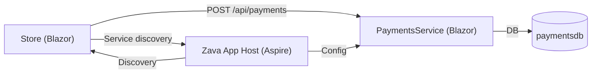
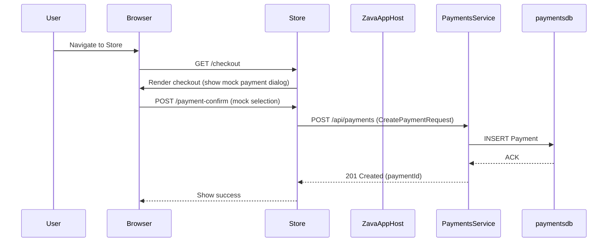

# PRD: Add Mock Payment Server / Payment Service to Zava-Aspire

Date: 2025-08-22
Author: Bruno Capuano & Copilot (documentation draft)

This document describes a Product Requirements Document (PRD) for adding a mock payment processing capability to the Zava-Aspire solution located in `src/`.

Purpose

- Provide a lightweight, mock payment flow for the `Store` frontend so checkout can be demonstrated end-to-end without integrating a real payment provider.
- Introduce a new Blazor Server-based Payment Service that is registered with .NET Aspire and persists payment records to a new `paymentsdb`.

Scope (what we'll deliver)

- A new Blazor Server project `src/PaymentsService` that exposes an API and a web UI to view processed payments.
- Integration points in `src/ZavaAppHost` to provision `paymentsdb` and pass the connection string to the Payment Service via Aspire configuration.
- A mock payment dialog/flow in `src/Store` that prompts the user at checkout and calls the Payment Service `POST /api/payments` endpoint.

Key success criteria

- The Store checkout flow invokes a mock payment prompt and posts purchase details to the Payment Service.
- The Payment Service stores each payment in `paymentsdb` and the Payments UI shows persisted payments.

Quick checklist (maps to user requirements)

- [ ] Mock server design: described in this PRD (processing, storage, UI).
- [ ] Checkout prompt: Store UI triggers mock payment and returns a selected mock payment method.
- [ ] New Blazor Payment Service: project created under `src/`, registered with Aspire.
- [ ] API endpoint: `POST /api/payments` and `GET /api/payments` documented in this PRD.
- [ ] Persist payments: records saved in `paymentsdb`.
- [ ] Aspire host: provisions `paymentsdb` and passes connection string.
- [ ] Payments UI: grid showing processed payments with optional product enrichment.

Assumptions

- Repository targets .NET 9 and the Aspire host is already configured in `src/ZavaAppHost`.
- Local dev uses project references and file-based or lightweight DBs (SQLite) by default for demos.
- No real payment gateway integration is required; this is a sandbox/mock flow only.

Design overview

- Service: `PaymentsService` (Blazor Server, net9.0) — exposes Web API for payments and a Blazor UI to view stored payments.
- Storage: `paymentsdb` — created/provisioned by the Aspire host; suggested provider for local dev: SQLite (file: `Data/payments.db`).
- Frontend: `Store` will show a mock payment dialog at checkout and call the Payment Service API.

Project layout suggestion

- `src/PaymentsService/`
  - `PaymentsService.csproj` (net9.0)
  - `Program.cs` (Aspire registration comments and wiring)
  - `Controllers/PaymentsController.cs` (API)
  - `Pages/Payments.razor` (grid UI)
  - `Services/IPaymentRepository.cs`, `PaymentRepository.cs` (data access)
  - `Models/PaymentRecord.cs`, `DTOs/CreatePaymentRequest.cs`, `DTOs/PaymentResponse.cs`
  - `Data/PaymentsDbContext.cs` (EF Core)
  - `Services/ProductEnricher.cs` (optional enrichment from Products DB)

API contract

- POST `/api/payments`
  - Request (JSON):
    - `storeId?: string`
    - `userId: string`
    - `cartId?: string`
    - `currency: string` (e.g. `USD`)
    - `amount: decimal`
    - `items: [{ productId: string, quantity: int, unitPrice: decimal }]`
    - `paymentMethod: string` (masked)
    - `metadata?: object`
  - Response: `201 Created` with body `{ paymentId: string, status: "Success" | "Failed", processedAt: string }`

- GET `/api/payments`
  - Query: `page`, `pageSize`, `status?`
  - Response: `{ items: PaymentRecord[], totalCount: int }`

Data model (paymentsdb)

- Table: `Payments` (columns)
  - `PaymentId` (GUID PK)
  - `UserId` (string)
  - `StoreId` (string)
  - `CartId` (string)
  - `Currency` (string)
  - `Amount` (decimal)
  - `Status` (string)
  - `PaymentMethod` (string)
  - `ItemsJson` (text)
  - `ProductEnrichmentJson` (text)
  - `CreatedAt` (datetime)
  - `ProcessedAt` (datetime)

Implementation details

## Payment Service (Blazor Server)

- Use EF Core with SQLite for local demos (`Microsoft.EntityFrameworkCore.Sqlite`). Provide an abstraction so provider can be changed.
- Register the Payment Service in Aspire (service registration + health checks). Add inline comments in `Program.cs` where Aspire-related wiring occurs.
- Implement `PaymentsController` with the two endpoints above. Validate incoming request and persist via `PaymentRepository`.

## Aspire host changes (`src/ZavaAppHost/Program.cs`)

- Provision `paymentsdb` for local dev (create `Data/payments.db`) and expose connection string via configuration key `ConnectionStrings:PaymentsDb` or `PaymentsDb__ConnectionString`.
- Register the new service name (e.g., `payments-service`) in Aspire's service registration so `Store` can discover it. Add comment lines where this is configured.

## Store frontend changes

- On the checkout page (`/checkout`), present a mock payment dialog with default user payment options. The dialog returns a `paymentMethod` string.
- Add a typed `HttpClient` named `PaymentsClient` in DI:

  - `builder.Services.AddHttpClient<IPaymentsClient, PaymentsClient>(client => client.BaseAddress = new Uri(configuration["Services:PaymentsService"] ?? "http://localhost:5004"));`

- Call `POST /api/payments` with the CreatePaymentRequest DTO.

## Product enrichment

- PaymentsService may optionally call the Products service API to map `productId` to product `title` or `sku` for display. This should be implemented behind a feature flag and be tolerant to failures.

Configuration & local defaults

- Suggested local ports:
  - PaymentsService: `http://localhost:5004`
  - Store (existing): keep current port; use Aspire discovery in runtime.
- Env/config keys:
  - `ConnectionStrings:PaymentsDb`
  - `Services:PaymentsService` (base URL)
  - `Payments:MockMode` (bool) — when true, simulate payment responses, else behave as configured.

Security & privacy notes

- Do not log raw card data. Use masked payment method strings only.
- For local demo, authentication between services may be relaxed; for production, enable service-to-service authentication via Aspire.

Testing & validation

- Unit tests: `PaymentRepository`, `PaymentsController`.
- Integration test: start Aspire host + PaymentsService + Store and run a test checkout flow; assert a row in `paymentsdb`.
- Manual smoke: Run Store, go to `/checkout`, perform mock payment, verify success and payment visible at Payments UI.

Acceptance criteria (detailed)

- [ ] Payment Service project exists at `src/PaymentsService` and targets `net9.0`.
- [ ] PaymentsService registers with Aspire (commented location in `Program.cs`).
- [ ] Aspire host provisions `paymentsdb` and exposes connection string to PaymentsService.
- [ ] Store shows a mock payment dialog at checkout and posts to PaymentsService.
- [ ] PaymentsService persists payment records and makes them available via `GET /api/payments`.
- [ ] Payments UI displays payments in a pageable/sortable grid and shows product titles when enrichment is available.

Developer implementation checklist (detailed tasks)

1. Create Blazor Server project: `dotnet new blazorserver -n PaymentsService -o src/PaymentsService --framework net9.0`.
2. Add NuGet packages: `Microsoft.EntityFrameworkCore`, `Microsoft.EntityFrameworkCore.Sqlite`, Aspire packages, `Swashbuckle.AspNetCore` (optional).
3. Implement `PaymentsDbContext`, `PaymentRecord` model and EF Core migrations.
4. Implement `PaymentsController` endpoints and repository.
5. Implement `Pages/Payments.razor` grid using a lightweight table component or HTML table.
6. Update `src/ZavaAppHost/Program.cs` to provision `paymentsdb` and register the service.
7. Update `src/Store` to add `PaymentsClient` typed HttpClient and a mock payment dialog component.
8. Add unit and integration tests.

Open questions for reviewers

- Preferred DB provider for CI and production? (SQLite for local demos, SQL Server or Azure SQL for production.)
- Confirm default local port for PaymentsService (suggest `5004`).
- Confirm authentication approach for service-to-service calls in non-local environments.

Rollout plan

1. Add the PaymentsService skeleton with in-memory persistence and `POST /api/payments`.
2. Wire Aspire host to provide `paymentsdb` connection string.
3. Switch in EF Core SQLite and run migrations.
4. Add UI page and enrichment.
5. Update Store and add E2E tests.

Appendix: example DTOs and API request/response

CreatePaymentRequest

```json
{
  "userId": "user-123",
  "currency": "USD",
  "amount": 39.98,
  "items": [
    { "productId": "prod-001", "quantity": 2, "unitPrice": 19.99 }
  ],
  "paymentMethod": "Visa ****1111"
}
```

CreatePaymentResponse

```json
{
  "paymentId": "7e9b8f9a-...",
  "status": "Success",
  "processedAt": "2025-08-22T12:34:56Z"
}
```

Mapping back to user requirements

- Mock server to process checkout & payments — covered under "Design overview" and API contract.
- Checkout prompt on the Store — covered under "Store frontend changes".
- New Blazor project & Aspire enrollment — covered under "Project layout" and Aspire host changes.
- API endpoint & DB persistence — covered under "API contract" and "Data model".
- Aspire host create `paymentsdb` — covered under "Aspire host changes".
- Payments UI — covered under "Pages/Payments.razor" and the UI section.

Notes

- This PRD intentionally does not change code. Implementation work should be done in a follow-up PR. Add inline comments in code where Aspire registration and DB provisioning occur so reviewers can verify compliance.

---

<!-- End of PRD -->

## User Manual (for the new Payments feature)

Purpose: provide concise step-by-step instructions for developers and demo users to run the PaymentsService, perform a mock checkout from the Store, and view payment records.

Prerequisites

- .NET 9 SDK installed
- Local clone of the repository
- Optional: Playwright MCP Server available (see Playwright section below)

Local run (developer)

1. From the repo root run:

```pwsh
dotnet build src/Zava-Aspire.slnx -c Debug
dotnet run --project src/ZavaAppHost -c Debug
dotnet run --project src/PaymentsService -c Debug
dotnet run --project src/Store -c Debug
```

1. Open the Store application in the browser (default port shown in host logs or `appsettings.Development.json`).
1. Add items to the cart and navigate to `/checkout`.
1. The mock payment dialog should appear with default masked payment methods. Select a method and confirm.
1. The Store will POST to the Payment Service `POST /api/payments`. On success, a confirmation is shown in the Store UI.
1. Open the Payments Service UI (`http://localhost:5004/payments` by default) to view the processed payment in the grid.

Troubleshooting

- If the Store fails to find the PaymentsService, verify the Aspire host service registration and the `Services:PaymentsService` configuration key or local port.
- If `paymentsdb` is missing, ensure Aspire host created it or run migrations for `PaymentsService`.

Playwright MCP Server (automated screenshots)

Purpose: use the Playwright MCP Server to run an automated script that navigates the Store checkout flow and the PaymentsService UI, takes screenshots of the key screens, and stores them for inclusion in the User Manual.

Suggested steps:

1. Install Playwright and the MCP Server as described in project docs (or use a local Playwright installation).
2. Create a Playwright test that:
   - Opens the Store homepage and navigates to a product page
   - Adds an item to cart
   - Navigates to `/checkout`
   - Triggers the mock payment and confirms
   - Waits for success UI
   - Opens the PaymentsService `/payments` page
   - Waits for the payments grid to show the new record
3. Use the MCP server or Playwright's `page.screenshot()` API to capture screenshots for the following screens:
   - Store product page
   - Checkout page with payment dialog
   - Store success confirmation
   - PaymentsService payments grid with the new record
4. Save the screenshots into `docs/images/payments/` and reference them in the User Manual sections.

Example snippet (Playwright TS)

```typescript
import { test, expect } from '@playwright/test';

test('checkout and payments screenshots', async ({ page }) => {
  await page.goto('http://localhost:5000');
  await page.screenshot({ path: 'docs/images/payments/home.png' });
  // ...navigate, add to cart
  await page.goto('http://localhost:5000/checkout');
  await page.screenshot({ path: 'docs/images/payments/checkout.png' });
  // interact with mock payment dialog (choose a payment method)
  await page.click('text=Confirm Payment');
  await page.screenshot({ path: 'docs/images/payments/success.png' });
  await page.goto('http://localhost:5004/payments');
  await page.screenshot({ path: 'docs/images/payments/payments-grid.png' });
});
```

Notes: run Playwright tests with:

```pwsh
npx playwright install
npx playwright test tests/payments-screenshots.spec.ts --headed
```

## Architectural guide

This section explains the new PaymentsService architecture, how it integrates with the Aspire host and the Store, and includes ASCII and mermaid diagrams.

Overview (ASCII diagram)

```
+-------------------+          +--------------------+          +-------------------+
|      Store UI     |  <---->  |   Zava App Host    |  <---->  |  PaymentsService  |
| (src/Store)       |          | (src/ZavaAppHost)  |          | (src/PaymentsSvc) |
+-------------------+          +--------------------+          +-------------------+
        ^  |                           |  ^                            |  ^
        |  |typed HttpClient           |  |service discovery           |  |EF Core
        |  +---------------------------+  +----------------------------+  |
        |                      Aspire provides config and secrets        |
        |                                                               |
        v                                                               v
  Browser (user)                                                   paymentsdb (SQLite)
```

Mermaid diagram (service-level)



Sequence diagram (mermaid)



Deployment notes

- The PaymentsService must be registered in the Aspire host so the host can provide health checks, telemetry, and configuration.
- `paymentsdb` should be provisioned by the Aspire host; for local dev use SQLite, for production use a managed SQL service.

## References and further reading

- .NET 9 SDK and guidance: [What’s new in .NET 9](https://learn.microsoft.com/dotnet/core/whats-new/dotnet-9)
- EF Core (current stable): [Entity Framework Core Documentation](https://learn.microsoft.com/ef/core/)
- ASP.NET Core Blazor: [Blazor documentation](https://learn.microsoft.com/aspnet/core/blazor)
- Playwright: [Playwright official site](https://playwright.dev/)
- Playwright integration with CI: [Playwright on Microsoft Learn](https://learn.microsoft.com/playwright)
- .NET Aspire (documentation placeholder): refer to project docs in the repo for Aspire-specific patterns and registration.
