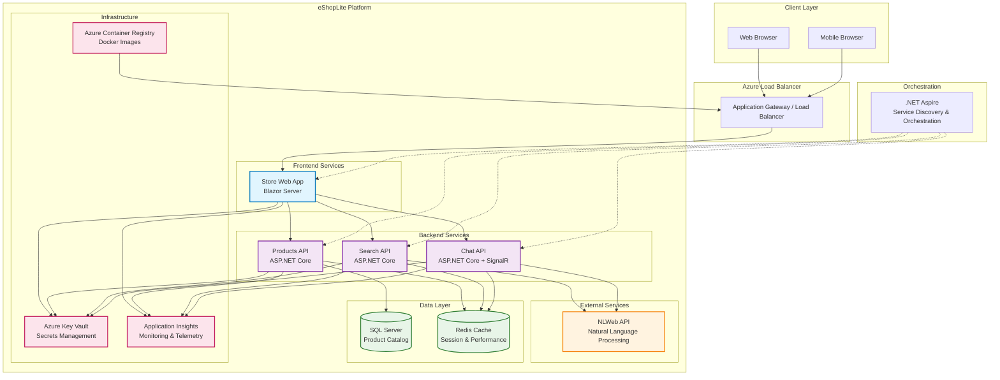
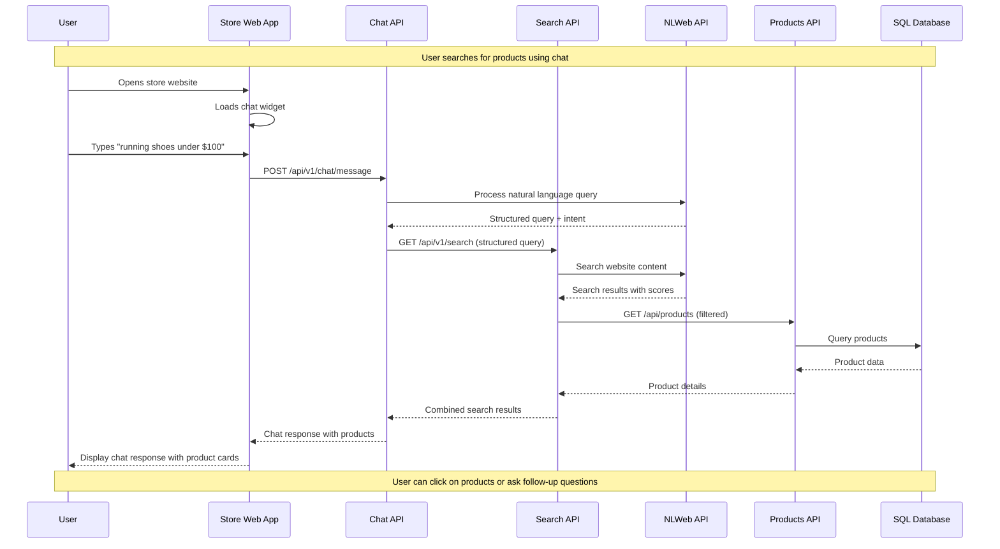
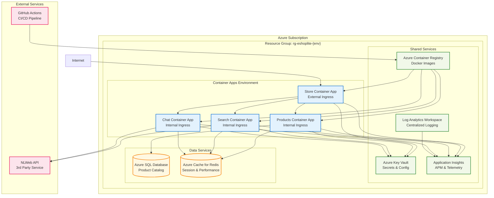
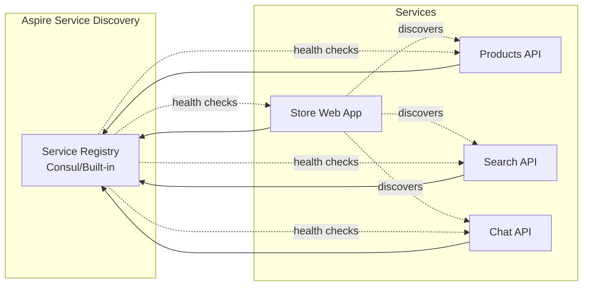
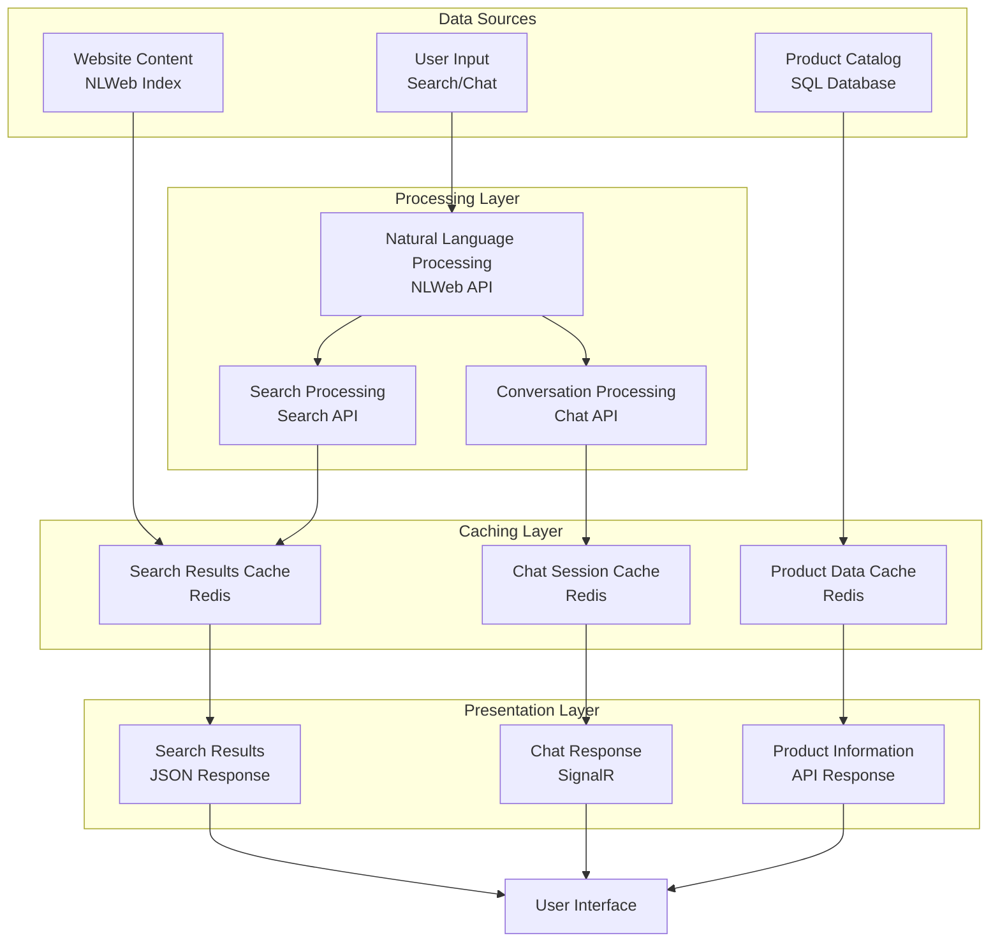
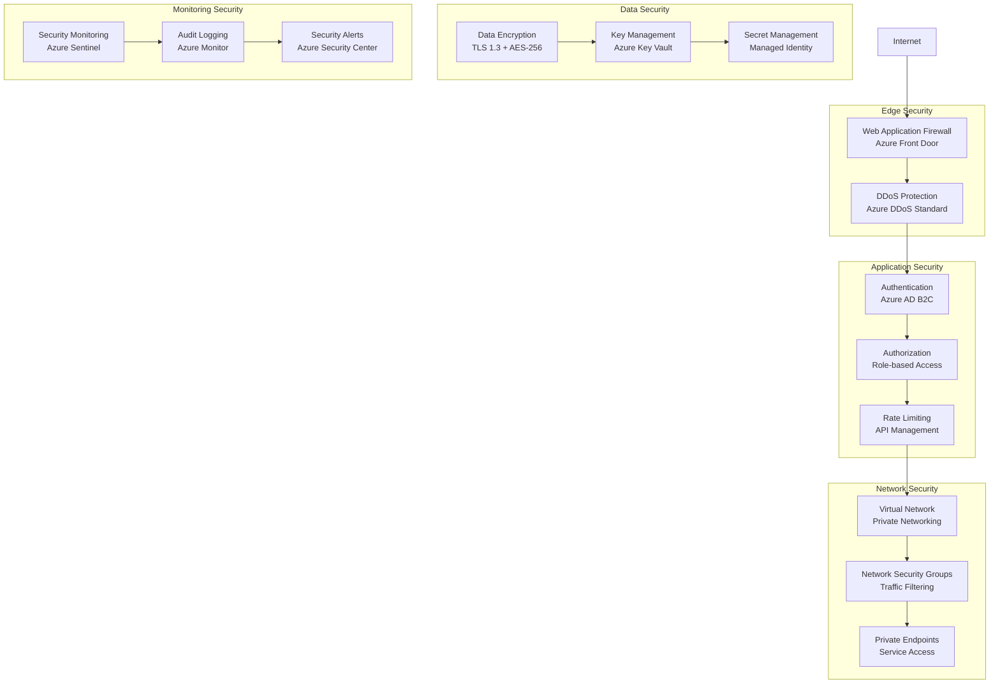
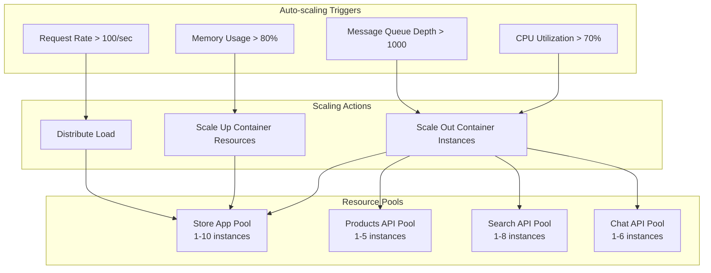
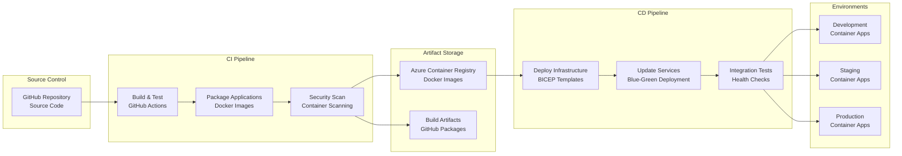
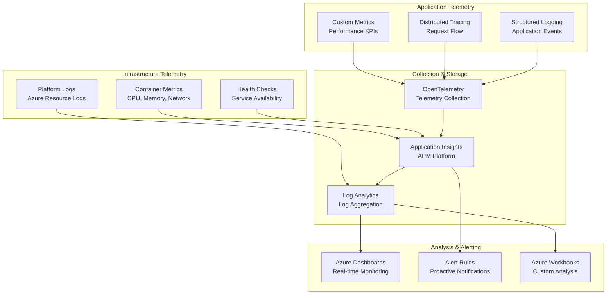

# Solution Architecture

This document provides a comprehensive overview of the eShopLite solution architecture, including system components, data flow, and service interactions.

## 🏗️ High-Level Architecture

## 🔄 Service Interaction Flow

### User Journey: Product Search with Chat Assistant

## 🏢 Deployment Architecture

### Azure Container Apps (Recommended)

## 🔌 Service Dependencies

### Service Dependency Matrix

| Service | Dependencies | Purpose |
|---------|--------------|---------|
| **Store** | Products API, Search API, Chat API | Main user interface |
| **Products** | SQL Database, Redis Cache | Product catalog management |
| **Search** | NLWeb API, Redis Cache | Natural language search |
| **Chat** | NLWeb API, Redis Cache, SignalR | Real-time chat assistance |

### Service Discovery with .NET Aspire

## 📊 Data Architecture

### Data Flow Patterns

## 🔒 Security Architecture

### Security Layers

## 📈 Scalability Patterns

### Horizontal Scaling Strategy

## 🔄 CI/CD Architecture

### Deployment Pipeline

## 📊 Monitoring & Observability

### Telemetry Architecture

---

## 📋 Architecture Decision Records (ADRs)

### ADR-001: Microservices Architecture
- **Decision**: Implement microservices pattern with .NET Aspire orchestration
- **Rationale**: Improved scalability, technology diversity, team autonomy
- **Consequences**: Increased complexity, network latency, service coordination

### ADR-002: Azure Container Apps vs App Services
- **Decision**: Default to Container Apps with App Services as alternative
- **Rationale**: Better scalability, cost efficiency, modern deployment patterns
- **Consequences**: Learning curve, different monitoring approaches

### ADR-003: SignalR for Real-time Communication
- **Decision**: Use SignalR for chat functionality
- **Rationale**: Native .NET integration, WebSocket support, fallback protocols
- **Consequences**: Sticky sessions required, scaling considerations

### ADR-004: Redis for Caching
- **Decision**: Implement Redis for distributed caching and session storage
- **Rationale**: High performance, distributed support, rich data structures
- **Consequences**: Additional infrastructure, cache invalidation complexity

---

*This architecture document is living and will be updated as the system evolves.*