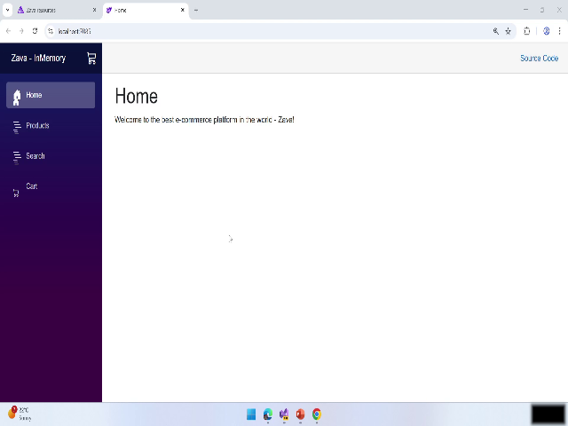
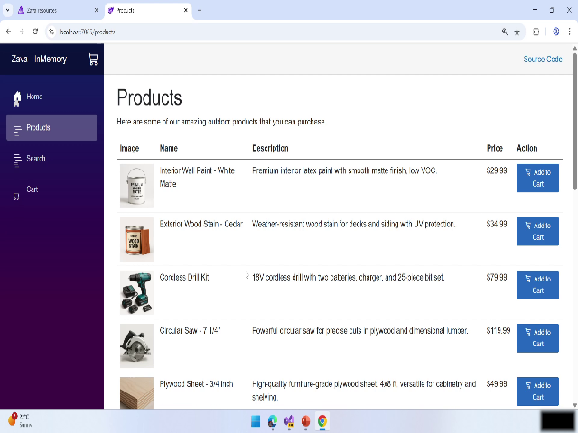
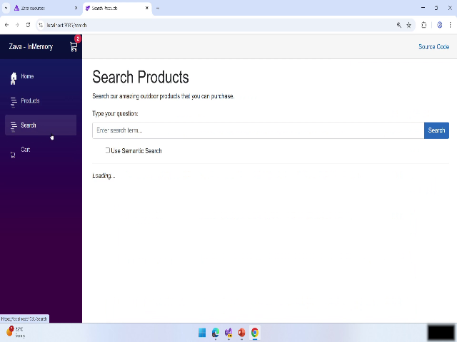
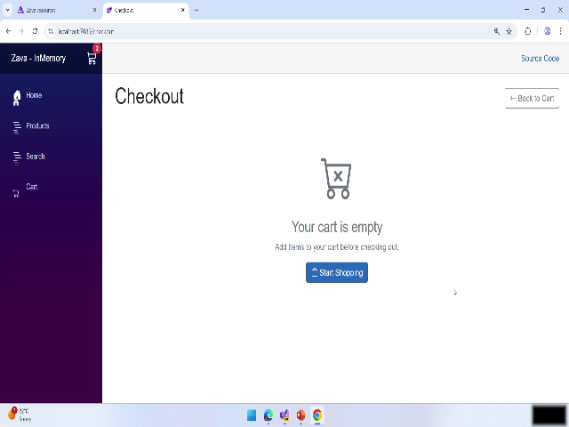

# Video: [brk447-02-Zava Overview.mkv](./REPLACE_WITH_VIDEO_LINK) — 00:00:57

# SAVA — E-commerce Integration User Manual

This manual documents the demonstrated SAVA migration and e-commerce flows shown in the referenced video. It guides users through adding items to the cart, validating search behavior, checking out, and noting known limitations. Each major step includes a reference timestamp and an image snapshot placeholder for quick visual reference.

---

## Overview

Duration: 00:00:55.480

This project integrates e-commerce sites into the new SAVA experience. The demonstration covers:

- Adding items to the cart from product listings  
- Verifying cart contents and count  
- Searching for products and validating actions in search results  
- Proceeding from cart to checkout (note: automatic cart clearing after checkout is not implemented)  
- Action items for the team: fix add-to-cart in search results, implement cart clearing after checkout, and polish localization / look-and-feel

Key topics: SAVA migration/integration, cart flows, search result behavior, checkout behavior, UI localization.

---

## Step-by-step instructions

All timestamps below reference the recorded demonstration. Use them to locate the exact moment in the video.

### 1. Open SAVA and review project scope
Timestamp:   

Steps:
1. Open the SAVA application and confirm you are on the e-commerce integration workspace.  
2. Verify target e-commerce sites are listed for migration/integration tasks.  

Snapshot:  

Tip: If you cannot find the workspace, confirm your user role has access to e-commerce integration settings.

---

### 2. Add products to the cart from product listings
Timestamp: 

Steps:
1. From the product listing view, locate the desired product (e.g., paint, stain).  
2. Click the product to open details if necessary.  
3. Click the "Add to cart" button for each item you want to purchase.  
4. Verify the cart count updates (example: count shows 2 items after adding paint and stain).  

Snapshot:  

Tip: Watch the cart icon/count after each "Add to cart" action to ensure the front-end updates properly.

Warning: If the count does not update, do not assume the server recorded the item—check network/console logs and reproduce the issue for debugging.

---

### 3. Search for products and validate available actions
Timestamp: 

Steps:
1. Use the search field to locate a product (e.g., type "paint").  
2. Review the search results list for the expected actions (e.g., "Add to cart").  
3. If the "Add to cart" action is missing in search results:
   - Document the issue with a short description and steps to reproduce.  
   - Capture a screenshot of the search results (include the search query and visible results).  
   - Log the issue in your tracking system for the development team to validate and fix.  

Snapshot:  

Tip: When filing a bug, include browser/OS, user role, and network console output if available.

---

### 4. Review the cart and proceed to checkout
Timestamp: 

Steps:
1. Open the cart view to review selected items and quantities.  
2. Confirm items and totals match expected selections.  
3. Click "Proceed to checkout" to complete the purchase flow.  
4. Note that, in the current implementation, the cart-clear (reset cart after successful checkout) is not implemented—items may remain in the cart after checkout.

Snapshot:  

Warning: Because cart clearing is not implemented, do not assume a successful checkout will empty the cart. Manually verify cart contents after checkout and advise users accordingly until the fix is deployed.

---

### 5. Action items — validate and implement fixes, and update localization/UI
Timestamp: 

Checklist for team members:
- Validate and reproduce the missing "Add to cart" action in search results.  
- Implement cart-clearing behavior after successful checkout.  
- Review and update general localization (locale strings) and look-and-feel to match SAVA style guidelines.  
- Add unit/integration tests to cover the search-result actions and post-checkout cart state.

Snapshot:  

Tip: Prioritize fixes that affect core purchase flow (search add-to-cart and cart clearing) to reduce user friction.

---

## Snapshots

  
  
  
  
