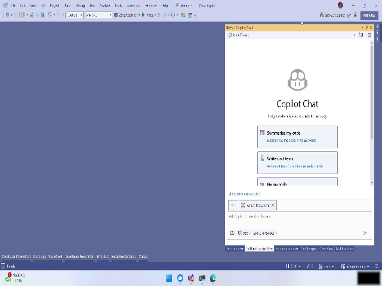
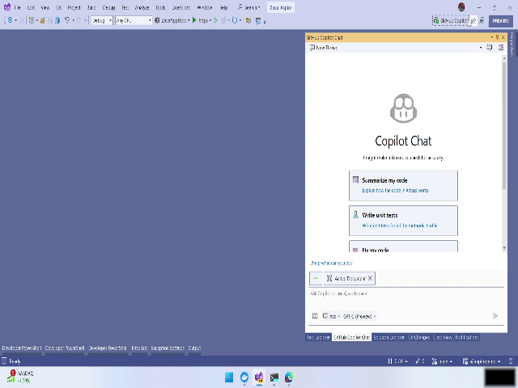

# GitHub Copilot in Visual Studio (Preview) — User Manual

This manual shows how to use the GitHub Copilot integration inside Visual Studio (preview) as demonstrated in the video. It covers enabling Copilot, checking usage/quotas, exploring Copilot modes, selecting models (example: switching to GPT-5), and asking Copilot to analyze and apply upgrades to code and infrastructure files.

- Total demo duration: 00:02:41.520
- Relevant UI elements: Copilot extension, inline suggestions, next-edit suggestions, consumption/usage panel, model selector, project files (C#, Bicep), Copilot response pane

---

## Overview

GitHub Copilot for Visual Studio (preview) provides inline AI suggestions while you code and a “next edit” suggestion feature. Copilot supports two interaction modes:

- Ask mode — Q&A-style interactions (good for questions about the system).
- Agent mode — Interactive agent that can take hands-on actions (modify code, update infra templates).

You can also view usage/consumption for your Copilot plan and select which model Copilot should use (example: switch to GPT-5). Copilot can propose and apply changes to both application code (C#) and infrastructure-as-code (Bicep).

Refer to the step-by-step sections below for actionable instructions.

---

## Step-by-step instructions

Note: Timestamps in brackets refer to the video demonstration for quick reference.

### 1. Open Visual Studio with Copilot integration (Intro) [00:00:01.800 — 00:00:17.700]

1. Launch the preview version of Visual Studio that includes the GitHub Copilot extension.
2. Confirm the Copilot extension is running; you should see inline suggestion UI while you type and prompts for the “next edit.”
   - Tip: Inline suggestions appear as ghost text; accept suggestions with the configured accept key (usually Tab).
   - Snapshot: )

Warning: This is a preview extension. Expect UI or behavior changes and enable it in a controlled environment.

### 2. Check consumption and plan status [00:00:17.700 — 00:00:33.680]

1. Open the Copilot consumption / usage panel from the Copilot extension controls or the account/plan area.
2. Inspect the usage meter for your plan. Example from the demo:
   - Pro plan usage: 28% used for premium request quota.
3. Verify other available quotas or resources shown in the panel.
   - Snapshot: )

Tip: Monitor the usage meter regularly to avoid exceeding premium request quotas.

### 3. Explore the solution architecture and choose Copilot mode [00:00:33.680 — 00:01:02.600]

1. Open the solution explorer to view project components:
   - Typical components: orchestrators, backend, frontend, and model configuration code.
   - Snapshot: )
2. Decide which Copilot mode fits your task:
   - Ask mode — Use for questions about architecture, configuration, or specific code behavior.
   - Agent mode — Use when you want Copilot to perform interactive coding or apply file changes.

Tip: Start in Ask mode for reconnaissance (what models are configured, what embeddings are used) before switching to Agent mode to make changes.

### 4. Query Copilot about the current model and select a different model (e.g., GPT-5) [00:01:02.600 — 00:01:54.560]

1. In the Copilot Q&A interface, ask: “Which OpenAI model is the solution using?”
2. Review Copilot’s reply to identify the currently configured model and any embedding model information.
3. Open the model selector/dropdown in the Copilot UI.
4. Choose the desired model (example: select GPT-5 from the list).
   - Confirm the change in the UI and in Copilot’s response.
   - Snapshot: )

Tip: A full set of models is available in the selector. Check compatibility with your application and infra before switching.

Warning: Changing models can affect cost and token usage. Verify plan quotas and cost implications in the consumption panel.

### 5. Ask Copilot to analyze configured models and create an upgrade plan [00:01:54.560 — 00:02:41.520]

1. Ask Copilot to list configured models and embeddings in the project (use Ask mode).
2. Request: “Create a plan to upgrade the project to GPT-5” and optionally “Consider switching to local models.”
3. Review Copilot’s proposed plan in the response pane. The plan may include:
   - Changes to C# code (configuration, SDK usage)
   - Updates to infrastructure templates (Bicep files) to deploy new model endpoints or local model infra
4. When ready, switch to Agent mode and instruct Copilot to apply the changes:
   - Example instruction: “Apply the upgrade changes to the C# project and update the Bicep templates.”
   - Copilot can create edits and open diffs for review.
   - Snapshot: )

Steps Copilot may perform automatically:
- Modify C# configuration classes to point to GPT-5 endpoint
- Update API usage or SDK calls if needed
- Edit Bicep templates to provision required compute, endpoints, or storage
- Create a commit or provide code diffs for review

Warnings and best practices:
- Always review diffs before accepting automated changes.
- Commit or back up your repository before allowing mass edits.
- Validate that infrastructure changes (Bicep) meet security and cost requirements before deployment.
- If offline/local model usage is requested, ensure you have the necessary hardware and licensing.

---

## Visual Tips and Shortcuts

- Accept inline suggestion quickly with Tab (or your configured acceptance key).
- Use Ask mode for quick questions like “Which model is configured?” or “What embeddings are used?”
- Use Agent mode when you want Copilot to open files and apply multi-file edits.
- Monitor the consumption meter when switching to premium or more powerful models.

---

## Snapshots

- Inline snapshot: Copilot inline suggestions and next-edit UI — 
- Inline snapshot: Consumption/usage panel with pro plan meter — 
- Inline snapshot: Solution/project structure (orchestrators, backend, front end, models) — 
- Inline snapshot: Model selector open, GPT-5 selected — 
- Inline snapshot: Copilot analysis and upgrade plan / apply-changes UI — 

---

## Snapshots

