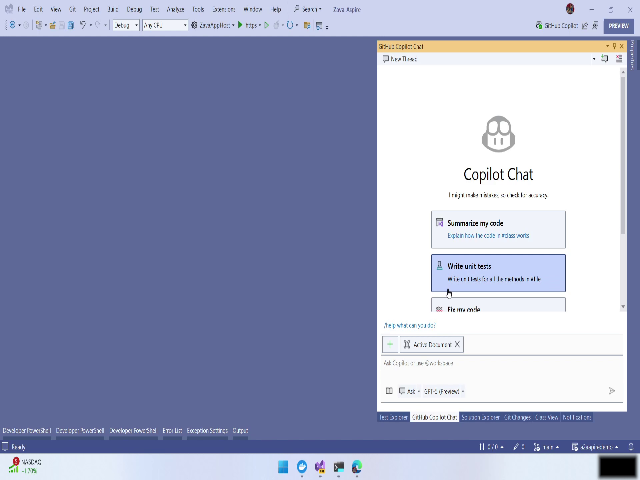
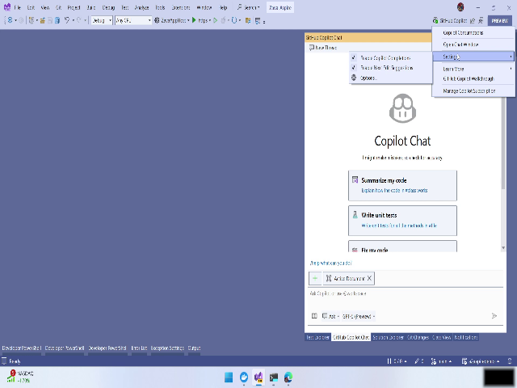
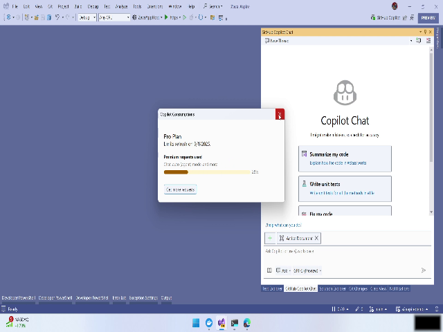
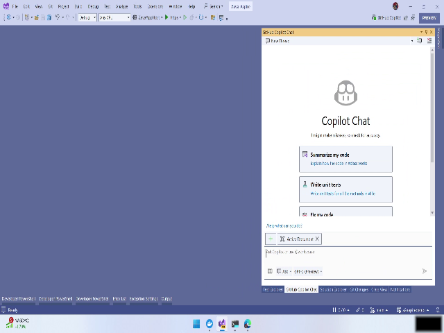
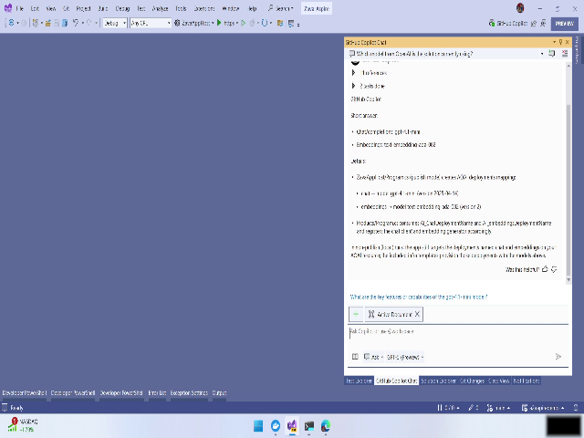
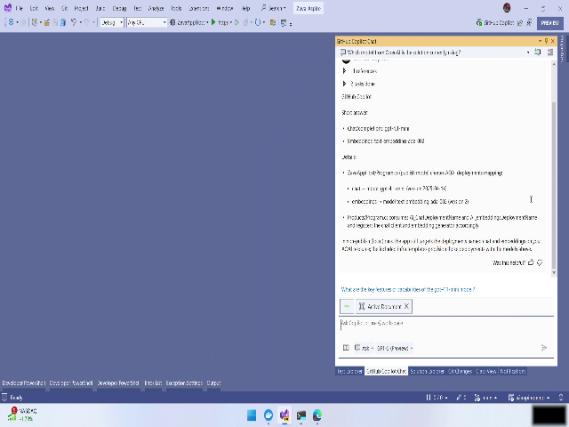

# Video: [brk447-03-VS2022 and GHCP Overview.mkv](./REPLACE_WITH_VIDEO_LINK) — 00:02:43

# GitHub Copilot in Visual Studio — User Manual

This manual guides you through using the GitHub Copilot integration inside Visual Studio as demonstrated in the video. It covers enabling Copilot, using inline suggestions and next-edit, checking consumption metrics, switching Copilot working modes, selecting models (example: GPT‑5), inspecting configured models/embeddings, and asking Copilot to produce and apply upgrade plans including code (C#) and infrastructure (Bicep) changes.

- Video duration reference: 00:00:01.800 — 00:02:41.520
- All timestamps below reference moments in the demo video.

---

## Overview

GitHub Copilot for Visual Studio provides AI-assisted coding features directly inside the IDE. Key capabilities shown in the demo:

- Inline suggestions as you type and a "next-edit" suggestion to propose the next change.
- Two working modes:
  - Ask mode — a question/response pane for natural-language queries.
  - Agent mode — an interactive, side-by-side coding assistant that can perform edits.
- Model selection and configuration (e.g., GPT‑4.1 mini, GPT‑5, embeddings models).
- Consumption/usage monitoring for Pro/premium requests.
- Copilot-assisted code and infrastructure changes (C#, Bicep) and planning for upgrades (e.g., moving to GPT‑5 or local models).

Snapshot: Copilot is shown enabled in Visual Studio (preview build).  

---

## Step-by-step instructions

Follow these steps to reproduce the actions demonstrated.

### 1. Open Visual Studio with GitHub Copilot enabled
Timestamp: 

1. Launch Visual Studio (use the preview build if you want the latest features shown in the demo).
2. Confirm the GitHub Copilot extension or integration is enabled:
   - Look for a Copilot pane, toolbar button, or indicator in the IDE.
   - The demo shows a preview indicator if you are running a preview build.

Tip: If you do not see Copilot, install or enable the GitHub Copilot extension from the Visual Studio Marketplace and sign in with your GitHub account.

---

### 2. Use inline suggestions and the Next-Edit feature
Timestamp: 

1. Open a code file (e.g., a C# file) and start typing.
2. Observe inline suggestions that appear in-line with your cursor.
3. To accept an inline suggestion:
   - Press the accept key (usually Tab or the configured accept key).
4. To invoke a broader "next-edit" suggestion:
   - Use the Next-Edit control in the Copilot UI to ask for the next recommended change.
   - Review the suggestion in the editor and accept or reject the edit.

Tip: Inline suggestions are intended to be fast and contextual; Next-Edit can propose larger or more contextual refactors.

Warning: Inline suggestions are suggestions — verify correctness, especially for security-sensitive or production code.

---

### 3. Check consumption / usage (Pro plan / premium requests)
Timestamp:  — (consumption UI shown in the same segment)

1. Open the Copilot consumption or usage panel from the Copilot menu or pane.
2. Review your Pro plan usage, which may display a percentage (demo shows 28%).
3. If usage is high, consider adjusting request frequency, model selection, or plan.

Tip: Monitoring consumption helps avoid unexpected charges when using premium models or features.

---

### 4. Understand the solution architecture and choose a working mode
Timestamp: 

1. Inspect the project solution in Visual Studio:
   - You may see components like orchestrators, backend, frontend, and models.
2. Choose a Copilot working mode:
   - Ask mode: Use the question/response interface to ask high-level questions (e.g., "Which OpenAI model is this using?").
   - Agent mode: Use the interactive assistant for side-by-side editing and automated changes.

Steps to switch mode:
- Open the Copilot pane and select the desired mode (Ask or Agent).
- In Ask mode, type your question and press enter.
- In Agent mode, follow the UI prompts to start an interactive session.

Tip: Use Ask mode for quick clarifications and Agent mode when you want Copilot to make changes or walk through a multi-step task.

---

### 5. Ask which model is in use and select a different model (example: GPT‑5)
Timestamp: 

1. In Ask mode, enter a question such as: "Which OpenAI model does this solution use?"
2. Review Copilot's response showing configured models.
3. To change models:
   - Open the model selector / dropdown in the Copilot pane.
   - Choose the desired model from the list (e.g., GPT‑5).

Tip: The model selector may list various options like GPT‑5, GPT‑4.1 mini, and embeddings models. Choose according to capability and cost.

Warning: Upgrading to a more powerful model may increase consumption and cost. Confirm plan and quota before switching.

---

### 6. Inspect Copilot's response for configured models and embeddings
Timestamp: 

1. After asking which models are configured, read Copilot's response.
   - Example from demo: AppHost defines GPT‑4.1 mini and an embeddings model.
2. Note which components use embeddings and which use chat features (backend, AppHost, etc.).

Use this information to plan targeted upgrades or changes to the specific components that rely on embeddings vs. chat.

---

### 7. Ask Copilot to create a plan to upgrade models (e.g., to GPT‑5) or switch to local models
Timestamp: 

1. In Ask or Agent mode, request a concrete plan. Example prompts:
   - "Create a plan to upgrade the configured models to GPT‑5."
   - "What steps are required to switch to local models?"
2. Review the plan Copilot returns. It can include:
   - Code changes (C#, configuration files).
   - Infrastructure changes (Bicep or Terraform).
   - Steps to test and validate the upgrade.
3. If using Agent mode, request Copilot to apply changes automatically:
   - Ask Copilot to modify C# files and Bicep files to implement the upgrade.
   - Review each proposed change in the change suggestion pane.
   - Accept or reject edits iteratively.

Tip: When asking for an upgrade plan, request a step-by-step checklist including testing and rollback steps.

Warning: Automated edits should be reviewed carefully. Backup your repository or create a feature branch before allowing broad automated edits.

---

## Snapshots (inline captures)

Below are the inline snapshot placeholders used above. These image placeholders should be replaced with the extracted frames corresponding to the listed timestamps.

- Intro / Copilot enabled in Visual Studio: !(snapshot_00_00_01_800.png)
- Inline suggestion and next-edit control: !(snapshot_00_00_12_960.png)
- Solution overview and modes: !(snapshot_00_00_31_880.png)
- Model selector (choosing GPT‑5): !(snapshot_00_00_55_720.png)
- Copilot response showing configured models/embeddings: !(snapshot_00_01_54_560.png)
- Requesting an upgrade plan / code edits: !(snapshot_00_02_11_680.png)

---

## Snapshots

  
  
  
  
  
