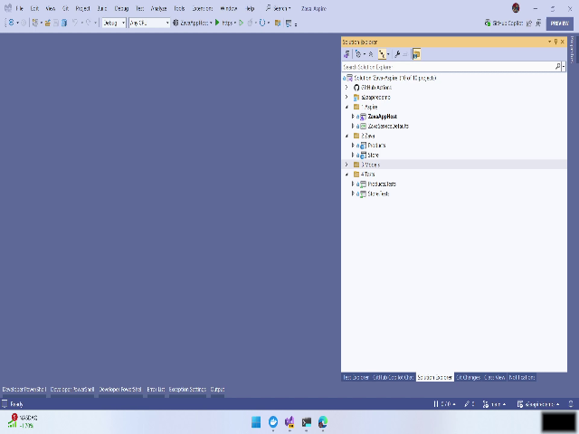
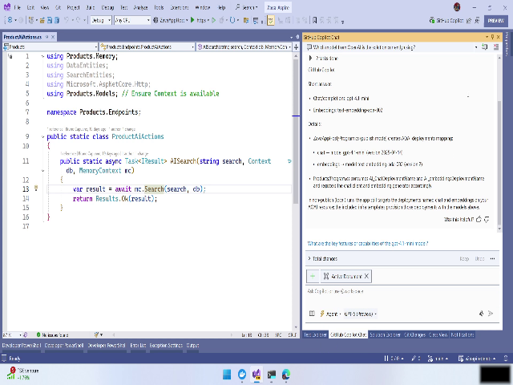
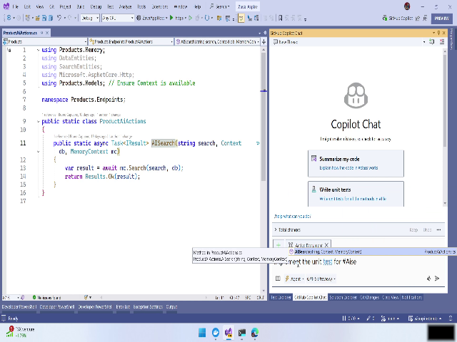
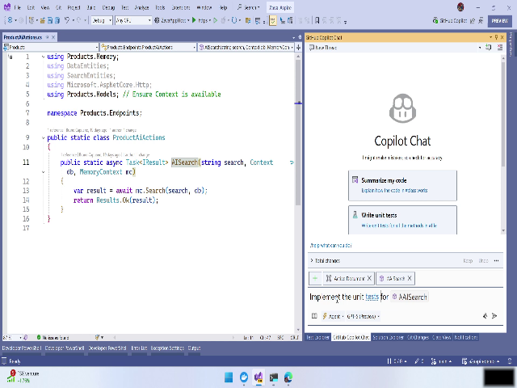
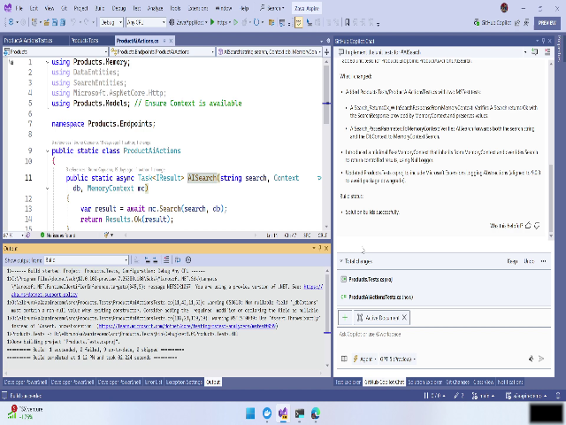
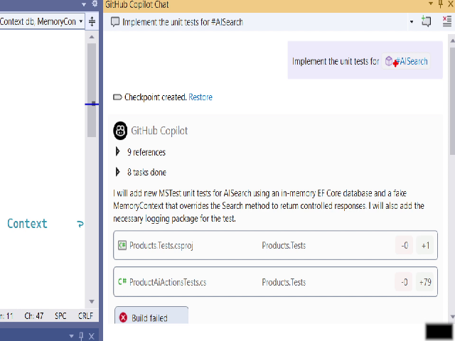

# Implementing Missing Unit Tests with Copilot (Agent Mode) — User Manual

This manual walks you through using Copilot in agent mode to implement missing unit tests for AI-related endpoints (AI search and "formal" search), review and accept generated changes, and run the tests in your IDE's Test Explorer.

- Total demo duration: ~00:04:00
- Primary goal: Add unit tests for AI search endpoints to prevent regressions

---

## Overview

This procedure shows how to:

- Switch Copilot to *agent mode* and create a chat configured for the AI search context
- Select a model (GPT-5 in the demo)
- Trigger a quick action (hashtag + task) to request implementation of unit tests
- Let Copilot read the solution, generate tests, attempt builds, and iterate
- Review and accept generated changes, then run tests with Test Explorer

Key UI elements used:
- Copilot (Agent mode)
- New Chat button and chat session UI
- AI Search context selector
- Model dropdown (GPT-5)
- Hashtag quick actions
- Build output / logs
- Accept Changes control
- Test Explorer and Run All Tests

Snapshot references are provided inline and collected at the end of this document.

---

## Step-by-step Instructions

Follow these steps to reproduce the workflow shown in the video. Timestamps are provided for quick reference.

### 1. Identify missing tests and define the task (00:00:02.400 — 00:00:41.560)
1. Open your solution/project workspace and navigate to the endpoints view to confirm the AI-related endpoints (AI search, formal search) are present.
2. Note which endpoints are missing unit tests. The objective is to have Copilot implement the missing tests to avoid regressions.

Tip: Keep a short list of endpoint names and expected behaviors before starting — this helps you review generated tests.

Snapshot:  

---

### 2. Switch Copilot to agent mode and create a new chat (00:00:41.560 — 00:01:15.920)
1. Open Copilot in your IDE.
2. Switch to *Agent mode* (look for an "Agent mode" toggle or option).
3. Click **New Chat** to start a fresh session.
4. Select the *AI Search* context for the chat (this scopes the assistant to relevant files and behavior).
5. Open the model dropdown and select **GPT-5** (or change to another model if needed).

Tip: If you have an existing chat with useful context, you can use "Previous chat" to reference it; however a new chat gives a clean start for code generation.

Snapshot:  

Warning: Ensure the context you choose (AI Search) points to the correct folder/files; wrong context may lead Copilot to analyze irrelevant code.

---

### 3. Trigger the task using a hashtag quick action (00:01:09.560 — 00:01:21.105)
1. In the chat input, type a hashtag followed by the task name to invoke a quick action. Example:
   - `#implement-unit-tests ai search`
2. From the quick action list that appears, select the option that corresponds to implementing unit tests for AI search.

Tip: Quick actions speed up requests—there may be multiple quick action suggestions; select the one that most closely matches your intent.

Snapshot:  

---

### 4. Let Copilot analyze the solution, generate tests, and iterate (00:01:21.105 — 00:02:56.040)
1. After invoking the quick action, allow Copilot to:
   - Read the entire solution or the relevant scope
   - Identify where unit tests are missing
   - Generate test code that exercises the AI endpoints
   - Attempt to build the project to validate the new tests
2. Wait while Copilot performs background analysis and compilation. This process can take roughly 1–2 minutes depending on project size.

What Copilot does automatically:
- Adds or modifies test files
- Updates dependencies if required (e.g., adds a mocking library)
- Runs build attempts and iterates on failures

Tip: Be patient while the analysis runs. Avoid making unrelated code changes during this automated process to prevent conflicts.

Snapshot (analysis in progress):  

Warning: If your workspace is large, the indexing/analysis may take longer. Ensure you have a stable environment (network, disk space) before starting.

---

### 5. Review generated changes, accept them, and run tests (00:02:56.040 — 00:03:58.600)
1. When Copilot completes its work, it will present the proposed changes (new test files, dependency updates, etc.).
2. Review the generated test code carefully:
   - Check that tests assert correct behavior and are not just superficial
   - Ensure any dependency additions are appropriate for your project
   - Confirm naming and scopes of tests (e.g., "Products AI test")
3. Click **Accept Changes** (or the equivalent action) to apply Copilot's modifications to your workspace.
4. Open the **Test Explorer** in your IDE.
5. Run tests:
   - Use **Run All Tests**, or
   - Run the newly added tests only (e.g., "Products AI test")
6. Inspect the build output and test results:
   - Confirm the build succeeded after any dependency additions
   - Verify the new tests are present and passing

Tip: If a generated test fails, inspect the failure message and relevant test code. Copilot iterates based on build/test feedback; you can trigger another cycle if needed.

Snapshot (successful build and tests visible):  

Warning: Do not blindly accept large or unexpected changes. If Copilot modifies core logic instead of only adding tests, review carefully or revert and request a narrower change.

---

### 6. (Optional) Plan broader analysis
If you want Copilot to check the entire solution for missing unit tests, prepare a broader quick action request (e.g., `#check-all-unit-tests`) and repeat the process. This expands Copilot’s scope to identify other endpoints or modules missing tests.

Snapshot (preview of broader analysis prompt):  

---

## Helpful Tips & Best Practices

- Always review generated tests and dependency changes before accepting them.
- Run tests locally after accepting changes to ensure environment-specific issues are caught.
- Keep commits small and descriptive when accepting generated code (e.g., "Add unit tests for Products AI search — generated by Copilot").
- If builds fail due to dependencies, review Copilot's suggested package additions; prefer specific, well-known libraries.

## Warnings

- Automated changes can introduce unexpected behavior. Manual review is required.
- Ensure your CI/Build environment mirrors your local environment to catch missing dependency issues early.
- Avoid running Copilot modifications on a protected branch without review.

---

## Snapshots

  
  
  
  
  
