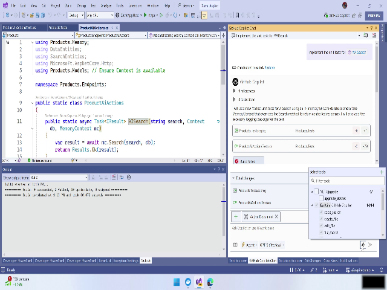
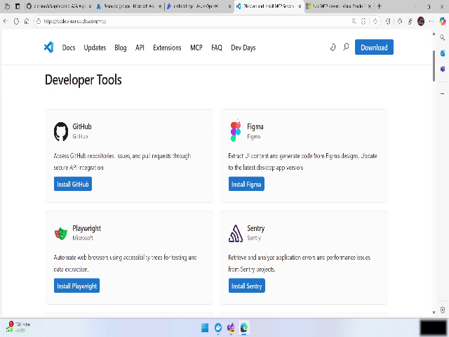
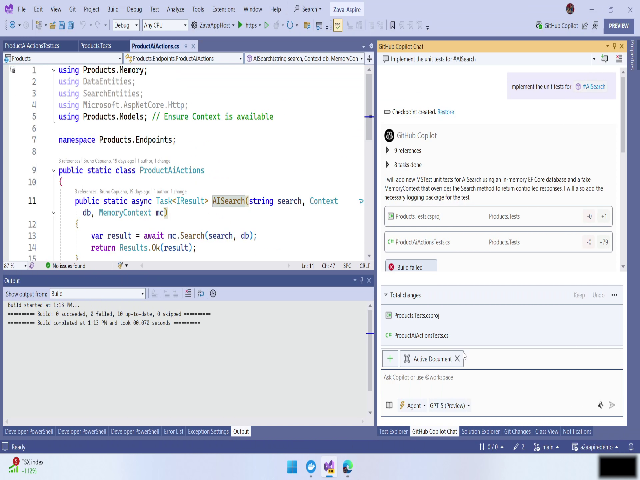
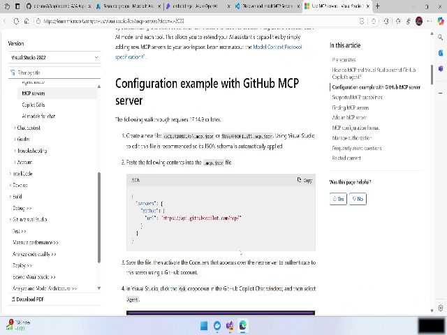
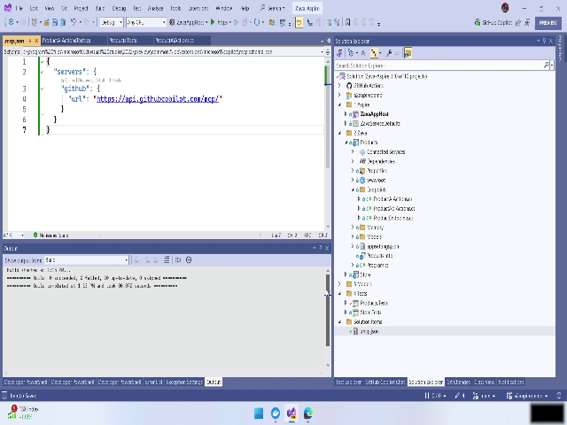
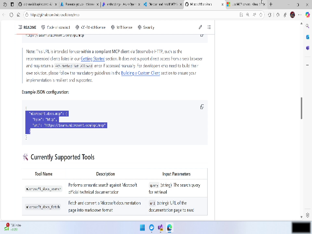

# Video: [brk447-05 add mcp servers.mkv](./REPLACE_WITH_VIDEO_LINK) — 00:02:42

# Empower GitHub Copilot with MCP Servers — User Manual

This manual shows how to add MCP (Managed Code Provider) servers to GitHub Copilot via Visual Studio by creating an mcp.json file in your solution root, adding server entries (GitHub and Microsoft Docs/Learn), authenticating, and verifying the available tools in Copilot Chat.

---

## Overview

Goal: Extend GitHub Copilot’s capabilities by registering external MCP servers (GitHub and Microsoft Docs/Learn) so Copilot can access additional tools and knowledge sources. (Video reference: 00:00:02.760 — 00:00:16.080)

What you’ll achieve:
- Inspect the default MCP tools available to Copilot
- Create an `mcp.json` file in your solution root
- Add GitHub and Microsoft Docs/Learn server entries
- Authenticate Visual Studio to allow Copilot to use those servers
- Verify the newly available tools in GitHub Copilot chat

Key UI elements referenced:
- Visual Studio — Solution Explorer and Add New File dialog
- `mcp.json` file (placed in solution root)
- Visual Studio authentication prompt
- GitHub Copilot Chat — Tools panel

---

## Step-by-step Instructions

Follow these steps in order. Each step includes a reference timestamp to the source video for context.

### 1. Inspect default MCP tools (00:00:16.080)
1. Open your solution in Visual Studio.
2. Open the default Copilot/MCP tools list to see which tools are available out of the box (the demo shows two default entries).
   - Video reference: 00:00:16.080 — 00:00:32.268

Tip: Recording shows Visual Studio’s MCP/Tools list; note the small default set before you add servers.

*Figure: Default MCP tools shown in Visual Studio (00:00:16.080)*

---

### 2. Choose servers to add (00:00:32.268)
Decide which external MCP servers to register. In the demo, the presenter adds:
- GitHub (to expose many GitHub tools)
- Microsoft Learn / Microsoft Docs

Follow any documentation you have to obtain the proper JSON entry snippets for these servers. The video notes that the instructions require an `mcp.json` file placed in the solution root.

Video reference: 00:00:32.268 — 00:00:56.528

Tip: Use official server configuration snippets from your organization or vendor documentation when possible.

---

### 3. Create an mcp.json file in the solution root (00:00:56.528)
1. In Visual Studio, open Solution Explorer.
2. Right-click the solution root (or project root, as instructed) and choose Add -> New Item / Add New File.
3. Name the file exactly `mcp.json` and add it to the solution.
4. Save the new file.

Video reference: 00:00:56.528 — 00:01:22.090

*Figure: Creating `mcp.json` in the solution root (00:00:56.528)*

Tip: The file must be in the solution root for Visual Studio to detect and apply it to Copilot.

---

### 4. Add the GitHub server configuration and authenticate (00:01:22.090)
1. Open `mcp.json` you created.
2. Paste the GitHub MCP server entry into the JSON file. An example (illustrative only — use the exact snippet from your docs):

   {
     "servers": [
       {
         "id": "github",
         "type": "gitHub",
         "url": "https://api.github.com",
         "displayName": "GitHub"
       }
     ]
   }

3. Save `mcp.json`.
4. Visual Studio will cache the server entry but will not connect until you authenticate. When prompted by Visual Studio, choose your local authenticated credential to allow Visual Studio to connect to GitHub on your behalf.
   - Accept the authentication prompt to complete the connection.

Video reference: 00:01:22.090 — 00:01:56.000

Warning: Allowing Visual Studio to use your local credentials grants access to your GitHub tools and repositories. Ensure you are comfortable with this access level in your environment.

Tip: After authenticating, the demo notes Copilot gained exposure to ~90+ GitHub tools.

*Figure: `mcp.json` containing the GitHub server entry and Visual Studio prompt (00:01:22.090)*

---

### 5. Add Microsoft Docs / Microsoft Learn server entry (00:01:56.000)
1. With `mcp.json` open, add the Microsoft Docs / Microsoft Learn server entry (example illustrative):

   {
     "servers": [
       {
         "id": "msdocs",
         "type": "docs",
         "url": "https://learn.microsoft.com",
         "displayName": "Microsoft Docs"
       }
     ]
   }

   If your `mcp.json` already contains a `servers` array, add the Microsoft Docs object into the array alongside the GitHub entry.

2. Save `mcp.json`.

Video reference: 00:01:56.000 — 00:02:40.320

Tip: Keep `mcp.json` valid JSON. Use a JSON formatter or Visual Studio’s built-in validator to avoid syntax errors.

---

### 6. Verify the new tools in GitHub Copilot chat (00:01:56.000)
1. Open GitHub Copilot chat inside Visual Studio and select "Assistant" mode.
2. Open the Tools panel within the Copilot chat.
3. Confirm you can see:
   - The newly added Microsoft Docs / Microsoft Learn tool
   - The expanded GitHub Copilot tools (exposed after GitHub authentication)

Video reference: 00:01:56.000 — 00:02:40.320

*Figure: Tools panel showing Microsoft Docs and GitHub tools (approx. 00:02:10)*

Tip: If you do not see the tools immediately, try:
- Saving and reloading the solution
- Restarting Visual Studio
- Re-opening Copilot chat

Warning: If Visual Studio did not prompt for authentication after adding the GitHub server entry, check your account sign-in status in Visual Studio’s Account settings.

---

## Snapshots

Use the timestamps below to capture frames of the UI states described above. Each timestamp is a suggested frame to extract for inline images referenced in this manual.

