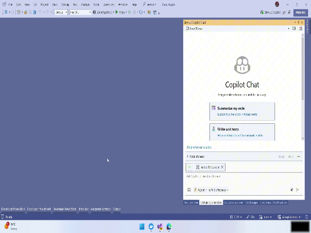
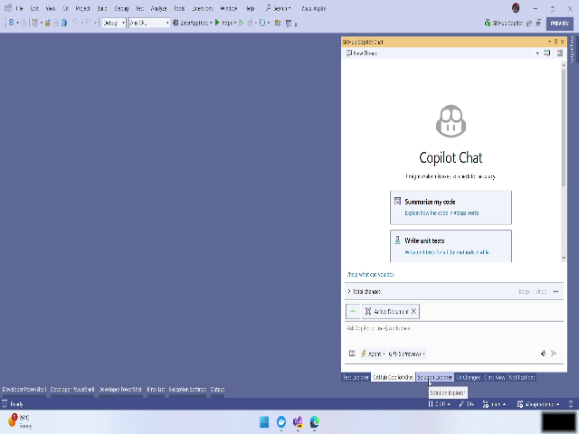
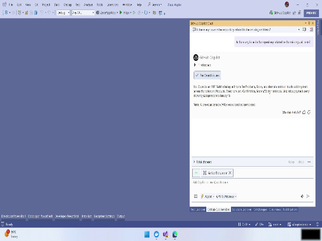
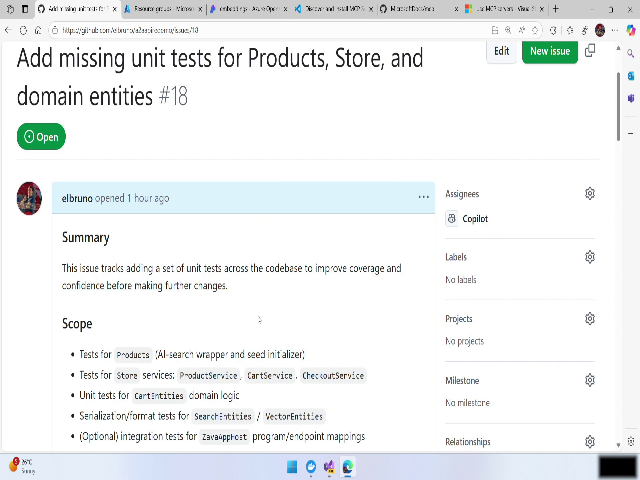
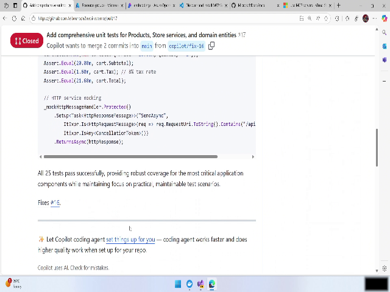
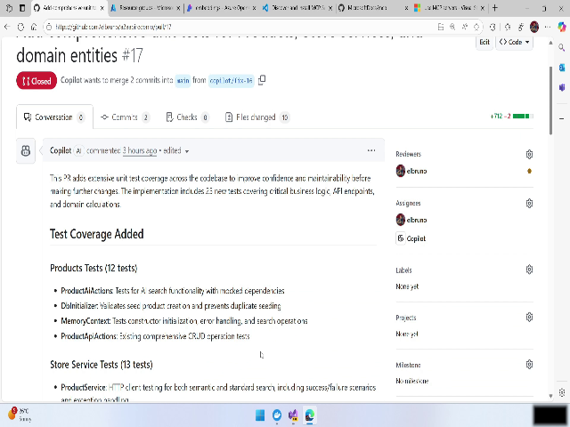
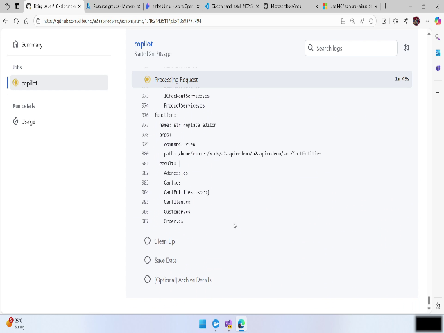

# Video: [brk447-07-Implement unit tests using GH Issue.mp4](./REPLACE_WITH_VIDEO_LINK) — 00:04:35

# Using GitHub Copilot to Implement Missing Unit Tests — User Manual

This manual explains how to identify missing unit tests in a repository, assign the work to GitHub Copilot (an agent that runs in an isolated cloud environment), and monitor the resulting pull request and workflow runs. It follows the workflow demonstrated in the source video and provides step‑by‑step instructions, helpful tips, warnings, and inline snapshot placeholders to guide you.

- Total demo duration referenced: 00:04:34.480

---

## Overview

This workflow shows how to:

- Search repository issues to find a task for missing unit tests (example: issue #18).
- Enable and permit GitHub tooling so Copilot can operate on the repository.
- Assign an issue to GitHub Copilot either from GitHub UI (recommended) or from Visual Studio.
- Observe Copilot creating an isolated cloud environment, forking the repo, implementing tests, and opening a pull request (PR).
- Inspect the PR’s changed files and session summary.
- Monitor the PR execution via GitHub Actions and inspect action run logs.

Use this manual to reproduce the same steps in your repository and to review results safely before merging.

---

## Step-by-step instructions

Note: timestamps in each section point to moments in the video that show the described UI and actions.

### 1) Introduction — local vs cloud test implementation [00:00:00.160 – 00:00:18.240]

What you’ll see:
- A conceptual comparison: running unit tests locally (fast) vs delegating work to an agent in the cloud.

Tip:
- Use the cloud agent when you want automated changes delivered through a PR without configuring a local environment.

Snapshot:
![Concept: local vs cloud unit test implementation]

---

### 2) Check repository issues & enable GitHub tooling [00:00:18.240 – 00:01:07.800]

Goal: Find existing issues about missing tests and allow Copilot tools to act.

Steps:
1. Open your repository on GitHub.
2. Ensure you have the GitHub tools/Copilot integration enabled. If prompted, allow the tool to execute actions for the repository (grant required permissions).
   - This typically shows as a dialog or a settings prompt: “Enable GitHub tools / allow tool execution.”
3. Navigate to the repository Issues tab and use the search box to find issues matching “missing unit tests”, “tests”, or specific filenames/modules.
4. Locate the relevant open issue (example in video: Issue #18 — “add missing unit tests for products, store and domain entity”).

What to look for:
- Issue title, description, acceptance criteria, and listed tasks.

Snapshot:
![Issue list showing open issues and GitHub tools prompt]

Tip:
- Use specific keywords like the module or feature name (e.g., “products store domain tests”) to narrow results.

Warning:
- Enabling tools gives the agent permission to create forks and pull requests. Confirm permissions and organization policy before proceeding.

---

### 3) Inspect issue details and decide how to assign work [00:01:07.800 – 00:02:02.600]

Goal: Confirm scope and assign the issue to Copilot.

Steps:
1. Click the issue number (e.g., #18) to open the issue detail page.
2. Read the scope, acceptance criteria, tasks and labels in the issue body.
3. Decide how to delegate:
   - Preferred: Use GitHub UI to assign the issue to Copilot (recommended in the demo).
   - Alternative: Assign from Visual Studio (if integrated and configured).
4. In GitHub, use the “Assign to Copilot” action/button (or the equivalent command in your environment).
   - The action will queue a cloud session where Copilot will create a fork, set up an environment, and implement changes.

Snapshot:
![Issue #18 detail page with 'Assign to Copilot' action]

Tip:
- Ensure acceptance criteria are clear and tests to be added are explicitly described to get predictable results from the agent.

---

### 4) Trigger Copilot to create a pull request (cloud execution) [00:02:02.600 – 00:03:02.360]

Goal: Observe Copilot beginning work and creating a PR.

Steps:
1. After assigning Copilot, refresh the issue page or the Issues list.
2. Look for a PR entry or status indicating Copilot has started a session and is working on a PR.
3. Click the PR entry to open PR details.
4. In PR details, you will typically see status updates such as:
   - Environment creation
   - Fork creation
   - Work in progress / session started
5. Allow the cloud run to complete (times vary; example session ~18 minutes in the demo).

Snapshot:
![Issue refreshed showing Copilot-created PR and fork status]

Warning:
- The agent creates a fork and commits changes to it — those changes are not merged into the main repository until you review and merge the PR.

---

### 5) Review completed PRs and changed files (example PR #17) [00:03:02.360 – 00:04:07.880]

Goal: Inspect the produced unit tests and the agent session summary.

Steps:
1. Open the example/finished PR (in the demo, PR #17).
2. Go to the “Files changed” tab to review added or modified files (look for new test files for product and store entities).
3. Read the session summary / timeline often shown in the PR or as a session view:
   - Typical steps: get repository, make a plan, view source code, run tests / add tests.
   - Note overall duration (demo example: ~18 minutes).
4. If the changes look correct, run the repository CI locally if desired and confirm tests pass before merging.

Snapshot:
![PR #17 Files changed view showing new unit test files]

Tip:
- Use the session summary to understand what the agent inspected and which files were changed. This is useful if you need to request follow-up changes.

---

### 6) Monitor current PR run and GitHub Actions logs [00:04:07.880 – 00:04:34.480]

Goal: Follow the PR CI run and view detailed logs.

Steps:
1. Open the active pull request created by Copilot.
2. Click the “Checks” or “Actions” tab on the PR page to find the associated GitHub Actions workflow run.
3. Open the specific workflow run entry.
4. Inspect the action run logs using the full log viewer to follow each step the workflow executed (e.g., checkout, build, test).
5. Use logs to:
   - Confirm that unit tests were executed
   - Identify failures or errors introduced by changes
   - Track progress and timing of each step

Snapshot:
![PR Actions tab and workflow run logs]

Tip:
- If tests fail in the Actions run, open the changed files and evaluate whether the test expectations or the production code require adjustment.

Warning:
- CI workflows may expose secrets or environment details in logs — only share logs with trusted parties.

---

## Inline snapshot placeholders

Below are suggested inline snapshot locations (these are placeholders; replace with extracted images from the corresponding timestamps):

- Concept: local vs cloud unit test implementation — ![Snapshot]
- GitHub tools enable and issue list — ![Snapshot]
- Issue #18 detail page and Assign to Copilot action — ![Snapshot]
- Copilot started PR / fork creation status — ![Snapshot]
- Example PR #17 files changed (new unit tests) — ![Snapshot]
- Active PR Actions / logs view — ![Snapshot]

---

## Tips & Best Practices

- Ensure issues include clear acceptance criteria before assigning to an agent — specificity improves outcomes.
- Review every agent-created PR manually before merging; agents may misinterpret ambiguous requirements.
- Keep your repository’s GitHub Actions and CI configuration up‑to‑date to run tests reliably.
- For sensitive or internal repositories, check organization policies before enabling agent/fork permissions.

## Warnings

- Granting tool execution permissions allows the agent to create forks, commits, and pull requests; review permissions first.
- Do not assume agent changes are final — always validate tests and behavior locally or in CI prior to merge.

---

## Snapshots

  
  
  
  
  
  
