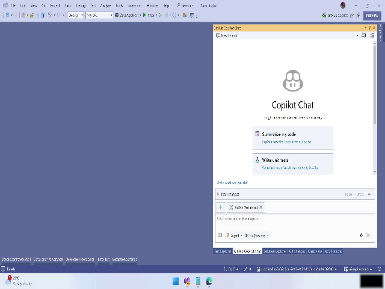
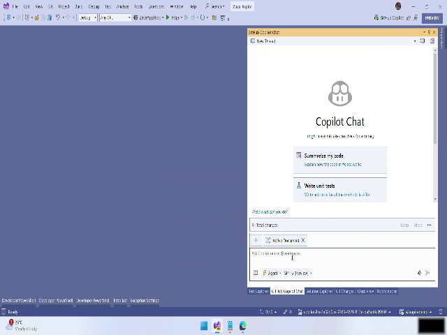
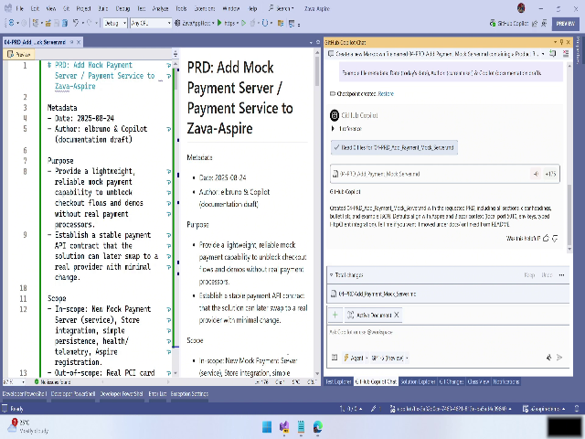
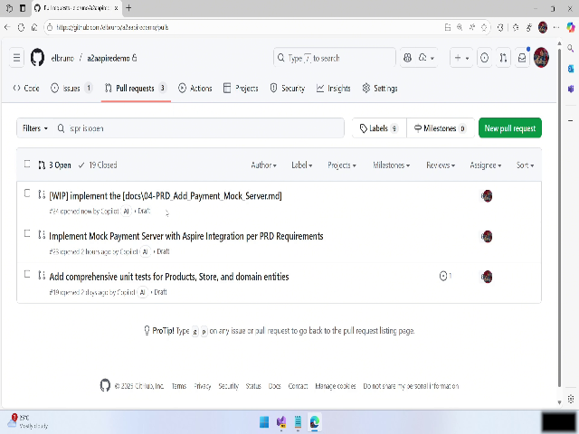
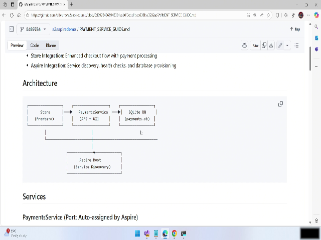
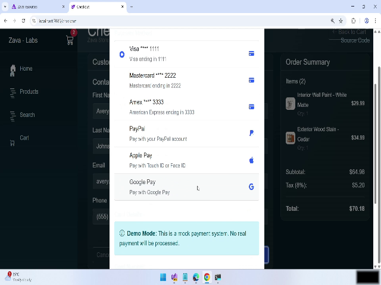
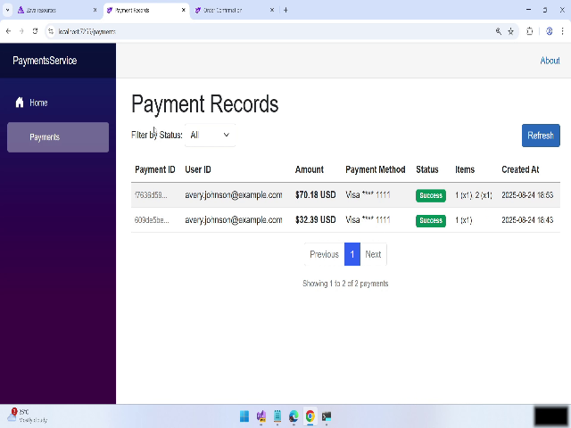
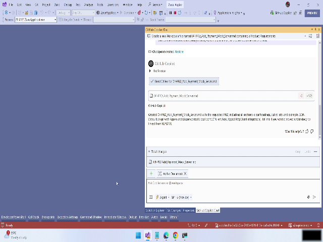
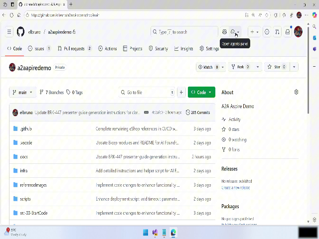

# Video: [brk447-09-coding-agent-implement-payment-PRD.mp4](./REPLACE_WITH_VIDEO_LINK) — 00:03:35

# Using a Product Requirement Document (PRD) with GitHub Copilot — User Manual

This manual shows how to use a Product Requirement Document (PRD) together with GitHub Copilot (both in-editor and coding agent/cloud modes) to generate, implement, test, and trace a new fake payment (checkout) service in a sample Lava SAPS environment. Steps include generating a PRD in Visual Studio, letting Copilot implement it via the coding agent (which creates a pull request and runs work in the background), running and testing the new checkout flow, and tracing the end-to-end transaction in Aspire.

Total demonstrated duration: ~00:03:31

---

## Overview

This workflow demonstrates a reproducible pattern:

- Create a clear PRD describing the feature you want (here: a fake payment server for integration testing).
- Use GitHub Copilot inside Visual Studio to generate a PRD file from a "mega prompt".
- Add the PRD to the repository and switch Copilot to coding agent (cloud) mode to implement the PRD automatically.
- Review the generated code and implementation guide.
- Run the application, exercise the checkout flow, and confirm the new service and order show up.
- Use Aspire traces to confirm end-to-end traceability from frontend to backend to the payment service.
- Switch back to developer mode when you need to make manual adjustments.

This manual provides step-by-step instructions to reproduce that process.

---

## Step-by-step instructions

Note: timestamps in brackets reference the video moments where the actions are demonstrated.

### 1. Prepare the scenario and describe it to Copilot (00:00:02 — 00:00:29)

1. Open Visual Studio and your sample Lava SAPS environment.
2. Define the scenario clearly for Copilot:
   - Example instruction you can paste into an editor or Copilot prompt:
     > Generate a PRD for a fake payment server to be used for integration testing in the Lava SAPS sample environment. Include scope, dates, proposed features, API surface, security considerations, and an implementation plan.
3. Make sure you mention:
   - Environment: Lava SAPS server containing existing services
   - Goal: a fake payment server for integration testing (simulate payment responses)
   - Deliverables: PRD file added to repo, code + docs, tests

Tip: The clearer and more structured your prompt, the higher-quality the generated PRD will be. 

![Intro: Describe scenario to Copilot]

---

### 2. Generate the PRD in Visual Studio using Copilot (00:00:29 — 00:01:04)

1. Copy your "mega prompt" into Visual Studio (or Copilot prompt panel).
2. Ask Copilot to generate the PRD (e.g., "Generate the PRD now").
3. Wait for generation to finish — complex PRDs may take some time to produce.
4. Inspect the generated PRD file:
   - Check for dates, scope, proposed features, API endpoints, acceptance criteria.
   - If anything is missing or unclear, refine your prompt and re-run generation.

Tip: If Copilot omits specifics (e.g., error responses or data model details), add explicit follow-up prompts asking for tables, endpoints, sample requests/responses, and test cases. 

![Copilot generating PRD in Visual Studio]

---

### 3. Add the PRD to the repository and switch to the Copilot coding agent (00:01:04 — 00:01:41)

1. Confirm the generated PRD file has been added to your repository (commit/push if required).
   - If Copilot created the file directly in the repo, verify it appears in the repo view.
2. Switch Copilot to coding agent mode (cloud/agent) to implement the PRD automatically in the repository:
   - Open the Copilot agent panel in the GitHub/IDE interface.
   - Select the target sample repository (the Lava SAPS sample).
3. In the agent panel, issue a clear instruction such as:
   - "Implement the PRD in this repository. Create necessary services, tests, documentation, and a pull request. Use the repo's conventions."
4. Allow the agent to run — it will create a pull request and perform background tasks to add code and docs.

Warning: The agent works asynchronously. It may take several minutes for PRs and files to appear while background tasks complete. Do not interrupt the process unless you need to stop or reissue instructions. 

![PRD added to repository and switch to coding agent]

---

### 4. Inspect the implementation output and generated documentation (00:01:41)

1. Monitor the agent panel for completion messages (the agent will indicate when the work is done).
2. Open the created pull request and review changes:
   - New service code (checkout/payment service)
   - Tests and configuration files
   - Generated documentation such as an "Implementation Guide", architecture overview, and README updates
3. Review the implementation guide for details about:
   - Architecture diagrams/overview
   - Database choice/configuration (note: Copilot often chooses SQLite by default)
   - API endpoints and how to integrate the fake payment server
4. If you plan to use a different database (for example, SQL Server), note the guide’s instructions to change DB providers later.

Tip: Generated documentation is a great starting point — verify it matches your environment (connection strings, configuration, container setup) and adapt as needed. 

![Generated implementation guide and architecture overview]

---

### 5. Run and test the new checkout/payment service in the app (00:02:21 — 00:03:07)

1. Start the application (locally or in your development environment) with the updated repository/PR changes merged or running in a feature branch.
2. In the running app UI:
   - Add sample products to the cart (add at least two items as shown in the demo).
   - Open the cart and click "Proceed to checkout".
   - Fill the required checkout fields (name, shipping, etc. — follow the generated UI).
   - Place the order.
3. Observe the UI:
   - The demo mode indicator may be present and some UI layout may use an older layout — this is expected in the demo environment.
   - Confirm that the new payment service was invoked and that a new order appears in the system.

Warning: Demo mode and layout mismatches may make UI elements look different — rely on the cart/checkout buttons and order lists to confirm success. 

![Run app and add items to cart]
![Place order and observe new checkout service]

---

### 6. Trace the transaction in Aspire (00:03:07 — 00:03:33)

1. Open Aspire traces (your tracing/observability UI).
2. Filter traces by the payment service name (or relevant service tag).
3. Inspect a representative trace of the checkout operation:
   - Verify the end-to-end chain: frontend request -> backend server -> payment service call
   - Confirm timing and spans show the call sequence and any errors or warnings
4. Use the trace to validate that:
   - The frontend triggered the backend checkout path
   - The backend called the fake payment server
   - The fake payment server returned the expected simulated response

Tip: Traces are useful to debug integration or timing issues. If you don’t see traces, ensure tracing instrumentation is enabled in each service and that environment/configuration was applied after agent changes. 

![Aspire tracing UI showing payment service trace]

---

### 7. Switch back to Copilot developer mode to make adjustments (00:03:33)

1. After validation, switch Copilot back to developer/editor mode to make manual changes:
   - Update database provider (e.g., change from SQLite to SQL Server) if required.
   - Tweak API behavior, tests, or docs generated by the agent.
   - Re-run local tests and integration tests.
2. Create a follow-up PR for any manual edits or improvements you want to persist.

Tip: Use the implementation guide as the authoritative reference for any configuration changes the agent made. 

![Switch back to Copilot developer mode]

---

## Tips & Warnings

- Tip: Start with the PRD approach when you want repeatable, auditable feature specifications that Copilot can implement end-to-end.
- Tip: When instructing the agent, be explicit about constraints (DB engine, frameworks, testing level) to avoid having to refactor generated code.
- Warning: Copilot’s coding agent may choose defaults (e.g., SQLite). If your environment requires a specific database, specify it in the PRD or change it after generation.
- Warning: Agent-created pull requests and background tasks can take time; do not assume immediate completion.
- Warning: Demo environments may have UI mismatches; verify functionality using traces and backend artifacts, not just UI appearance.

---

## Snapshots

Below are timestamps marking exact moments suitable for capturing images to illustrate steps in this manual. Insert the frame images at the corresponding inline placeholders above.

