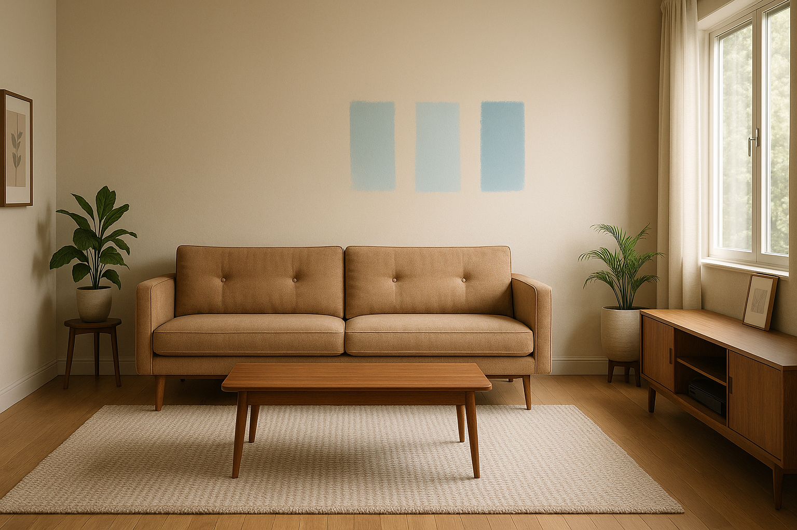

# Scenario 1 — Customer POV Image Prompts (Placeholders)

Purpose: ready-to-use GPT-IMAGE-1 prompts (16:9) from the customer's point-of-view (POV, room-only) with placeholders you can replace with generated images later.

Plan:

- Deliver three scenarios keeping the format: Request + View (POV, no hands/phone/people).
- Provide a copy/paste-ready `gpt-image-1` prompt for each scenario with generation settings (aspect ratio, size, camera, lighting, level of detail).
- Add a Markdown image placeholder for each scenario (replace after you generate images).

---

## 1) Living room repaint

- **Request:** `I want to paint this living room blue.`

- **View:** POV from the center of the living room showing the sofa, coffee table, rug, media wall and the wall targeted for painting; no hands, no phone, no people — only the room interior in natural daylight.

### GPT-IMAGE-1 prompt (copy/paste-ready) — Living room

```text
POV interior photograph of a living room from the customer's perspective: neutral beige wall targeted for repainting, mid-century modern sofa, wooden coffee table, textured area rug, media console, large window with soft daylight, potted plants and framed art on side walls; scene contains no people, no hands, no phone, no personal items in the foreground — only the room interior. Aspect ratio 16:9. Size suggestion: 2048x1152. Style: photorealistic, ultra-detailed. Lighting: soft natural daylight, warm color temperature, balanced shadows. Camera: eye-level perspective (~1.5m), 35mm equivalent, slight wide-angle, shallow-to-medium depth of field so the target wall is clearly in focus. Resolution/Detail: very high detail (4k equivalent) — crisp textures on fabric, paint surface, wood grain, and soft rug fibers. Color palette: existing neutral tones with subtle blue swatches indicated on the target wall (muted teal / soft blue / sea-glass) — do not render UI elements, only subtle color differences on the wall. Composition: rule of thirds, wall centered-right, leading lines from rug and coffee table toward wall. Emphasize realistic reflections and natural shadowing. Negative: no text overlays, no brand logos, no people, no hands, no phones, no heavy vignette, avoid surreal effects.
```

Suggested image placeholder (replace after generation):

`

---

## 2) Bathroom mirror replacement

- **Request:** `I want to replace the mirror in this bathroom.`

- **View:** POV at eye level facing the bathroom wall and mirror, showing the sink, tiles, and the existing mirror; no hands, no phone, no people — only the bathroom interior.

### GPT-IMAGE-1 prompt (copy/paste-ready) — Bathroom mirror

```text
POV interior photograph of a bathroom from the homeowner's perspective: eye-level view centered on the existing rectangular mirror above a white sink, porcelain countertop, modern chrome faucet, ceramic tile wall with visible grout, under-cabinet lighting and a small towel rack; scene contains no people, no hands, no phone — only the bathroom interior. Aspect ratio 16:9. Size suggestion: 2048x1152. Style: photorealistic, high-detail. Lighting: cool white LED with soft fill light, subtle highlights on mirror and chrome. Camera: 35mm–50mm equivalent at eye height, medium focal length, close-to-medium framing so the mirror and surrounding tile are the focal point. Resolution/Detail: very high detail — visible tile texture, grout lines, subtle wear on mirror frame. Color palette: neutral bathroom tones (cool grays, whites). Composition: mirror centered, sink and countertop foreground, negative space reserved to visualize replacement options. Negative: no people, no hands, no phones, no personal toiletry clutter in foreground, no brand logos, no text overlays.
```

Suggested image placeholder (replace after generation):

`

---

## 3) Kitchen backsplash update

- **Request:** `I want to update the backsplash behind my kitchen counter.`

- **View:** POV from the kitchen workspace looking at the backsplash area, countertop, and under-cabinet lighting; no hands, no phone, no people — just the kitchen interior.

### GPT-IMAGE-1 prompt (copy/paste-ready) — Kitchen backsplash

```text
POV interior photograph of a kitchen from the user's perspective: eye-level view focused on the backsplash area above the countertop, shows countertop with minimal items (a bowl of fruit softly out of focus), existing subway tile backsplash, under-cabinet lighting casting soft highlights, cabinets and faucet visible; scene contains no people, no hands, no phone — only the kitchen interior. Aspect ratio 16:9. Size suggestion: 2048x1152. Style: photorealistic, ultra-detailed. Lighting: balanced natural + warm under-cabinet accent lighting, realistic specular highlights on tile. Camera: 35mm perspective, eye-level, medium framing with backsplash prominent and crisp, slight background bokeh for depth. Resolution/Detail: very high detail (4k equivalent) — individual tile texture, grout detail, subtle reflections. Color palette: neutral countertop tones with unobtrusive candidate swatches visible on the tile area (white marble, blue glass mosaic, matte charcoal). Composition: backsplash centered, counter leading line across the bottom third of frame. Negative: no people, no hands, no phones, no brand logos, no text overlays, avoid overly stylized filters.
```

Suggested image placeholder (replace after generation):

`

---

### Negative prompt (apply to all three)

```text
No people | No hands | No phones | No visible brand logos | No text overlays | No cartoon/painterly filters | Photorealistic only
```

---

### Quick tips for consistent results

- Use the same size/aspect for all three images: `2048x1152` (16:9).
- Keep style set to `photorealistic` and high detail / 4k equivalent.
- When pasting to `gpt-image-1`, include the negative prompt line to avoid UI or people appearing.
- If you want alternate color variants, change the color-swatch text in the prompt (e.g., "paint this wall soft cobalt blue" or "swatches: pale gray, slate blue, terracotta").

---

When you have the generated images, place them in the repository at the placeholder paths (for example `./images/living-room-repaint-16x9.png`) or tell me the filenames and I’ll update this Markdown with the actual image embeds.
