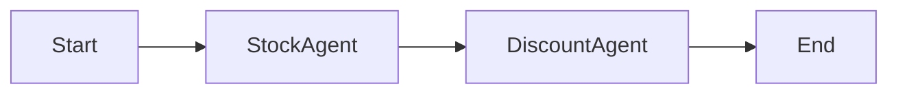

# eShop Lite - Mermaid Workflow Visualization & Location-Based Stock

[](https://dotnet.microsoft.com/download/dotnet/9.0)
[](../LICENSE)
[](https://docs.microsoft.com/en-us/dotnet/csharp/)
[](https://learn.microsoft.com/en-us/dotnet/aspire/)

> **Advanced eShop scenario featuring Mermaid workflow visualization, location-based stock queries, and a triage agent for intelligent request routing**

This folder (`src-05-mermaid-location`) extends the base eShop Lite demo with advanced features for visualizing agent workflow execution and location-based inventory management.

---

## 📋 Scenario Overview

This implementation demonstrates:

1. **Mermaid Workflow Visualization** - Real-time visualization of the agent workflow execution as interactive Mermaid diagrams in the cart UI
2. **Location-Based Stock Queries** - Support for querying product stock at specific store locations
3. **Triage Agent** - An intelligent routing agent that determines which specialist agent (Stock or Discount) should handle a request
4. **Handoff Workflow Orchestration** - Dynamic agent handoff patterns using the Microsoft Agent Framework
5. **External Stock Search Tool** - Tool-augmented agent that can query the Products API for real-time stock information

---

## 🎯 Key Features

### Mermaid Workflow Visualization

When you apply the AI discount in the cart, the system generates a Mermaid diagram representing the workflow execution:

- **Sequential Workflow**: Shows the flow from StockAgent → DiscountAgent
- **Handoff Workflow**: Shows the triage-based routing between agents
- **Collapsible UI**: The workflow diagram is displayed in an expandable section



### Location-Based Stock Management

The scenario includes location-aware inventory tracking:

| Location | Address | City | State |
|----------|---------|------|-------|
| Downtown Store | 123 Main Street | Seattle | WA |
| Mall Location | 456 Shopping Ave | Bellevue | WA |
| Warehouse Outlet | 789 Industrial Blvd | Redmond | WA |

Products can have different stock quantities at each location, enabling location-specific stock checks.

### Triage Agent

The Triage Agent acts as an intelligent router:

```
"You determine which agent to use based on the user's request.
For stock availability questions, handoff to stock_agent.
For discount calculations, handoff to discount_agent.
ALWAYS handoff to another agent."
```

---

## 🏗️ Architecture

### Agent Services

| Agent | Responsibility | Key Features |
|-------|---------------|--------------|
| **TriageAgent** | Routes requests to appropriate specialist agents | Handoff-based routing |
| **StockAgent** | Validates product availability | Location-aware queries, external tool integration |
| **DiscountAgent** | Computes membership-based discounts | Gold: 20%, Silver: 10%, Normal: 0% |
| **AgentCheckoutOrchestrator** | Coordinates multi-agent workflow | Sequential and handoff patterns |

### Stock Search Tool

The `StockSearchTool` is an external tool that the Stock Agent can invoke to query real-time stock information:

```csharp
[Description("Searches for product stock by name. Returns stock information including quantities across all locations.")]
public async Task<string> SearchProductStockAsync(
    [Description("The name or partial name of the product to search for")] string productName)
```

### Workflow Patterns

**Sequential Workflow** (Default):
```csharp
var workflow = AgentWorkflowBuilder.BuildSequential(
    workflowName: "CheckoutWorkflowSequential",
    agents: [stockAgent, discountAgent]);
```

**Handoff Workflow** (Dynamic):
```csharp
var handoffWorkflow = AgentWorkflowBuilder.CreateHandoffBuilderWith(_triageAgent)
    .WithHandoffs(_triageAgent, [_stockAgent, _discountAgent])
    .WithHandoff(_stockAgent, _triageAgent)
    .WithHandoff(_discountAgent, _triageAgent)
    .Build();
```

---

## 📁 Project Structure

```
src-05-mermaid-location/
├── eShopLite-Aspire-Modernization-05-mermaid-location.slnx
│
├── eShopAppHost/                 # .NET Aspire App Host
│   └── Program.cs                # Service orchestration
│
├── eShopServiceDefaults/         # Shared service configuration
│
├── AgentServices/                # AI Agent services
│   ├── Checkout/
│   │   └── AgentCheckoutOrchestrator.cs  # Workflow orchestration
│   ├── Discount/
│   │   └── DiscountAgentService.cs       # Membership discounts
│   ├── Stock/
│   │   ├── StockAgentService.cs          # Stock validation
│   │   └── Tools/
│   │       └── StockSearchTool.cs        # External API tool
│   ├── Triage/
│   │   └── TriageAgentService.cs         # Request routing
│   ├── Configuration/
│   │   └── AgentSettings.cs
│   ├── Models/
│   │   ├── CheckoutModels.cs             # WorkFlowMermaid property
│   │   ├── DiscountModels.cs
│   │   └── StockModels.cs                # LocationId support
│   └── AgentServicesExtensions.cs        # DI registration
│
├── Products/                     # Products API
│   ├── Endpoints/
│   │   ├── ProductEndpoints.cs           # API route definitions
│   │   ├── ProductApiActions.cs          # Location & stock endpoints
│   │   └── ProductAiActions.cs           # AI search
│   ├── Models/
│   │   └── Context.cs                    # EF Core with locations
│   └── Data/
│       └── DbInitializer.cs              # Location seed data
│
├── Store/                        # Blazor Server front-end
│   ├── Components/
│   │   ├── Pages/
│   │   │   ├── CartPage.razor            # AI discount button
│   │   │   └── Locations.razor           # Location management page
│   │   └── Cart/
│   │       └── CartSummary.razor         # Mermaid visualization
│   └── Services/
│       └── CheckoutService.cs            # WorkFlowMermaid handling
│
├── DataEntities/                 # Data models
│   ├── Location.cs                       # Store location entity
│   └── ProductsByLocation.cs             # Stock by location
│
├── CartEntities/                 # Cart models
│   ├── Cart.cs                           # WorkFlowMermaid property
│   └── AgentStep.cs                      # Agent execution tracking
│
├── SearchEntities/               # Search response models
├── VectorEntities/               # Vector embedding models
│
├── Products.Tests/               # Products API tests
└── Store.Tests/                  # Store front-end tests
```

---

## 🚀 Quick Start

### Prerequisites

- [.NET 9 SDK](https://dotnet.microsoft.com/download/dotnet/9.0) (9.0.x or later)
- [Docker Desktop](https://www.docker.com/products/docker-desktop/) (for SQL Server container)
- Azure OpenAI or Microsoft Foundry connection string (for AI features)

### Running the Application

1. **Navigate to the scenario folder**
   ```bash
   cd src-05-mermaid-location
   ```

2. **Configure AI Connection**
   ```bash
   cd Store
   dotnet user-secrets init
   dotnet user-secrets set "ConnectionStrings:microsoftfoundry" "your-azure-openai-connection-string"
   ```

3. **Run with .NET Aspire**
   ```bash
   cd eShopAppHost
   dotnet run
   ```

4. **Open the Aspire Dashboard** and access the Store endpoint

---

## 🎮 Demo Flow

### 1. Explore Locations

Navigate to `/locations` to see the available store locations:
- Downtown Store (Seattle)
- Mall Location (Bellevue)
- Warehouse Outlet (Redmond)

### 2. Add Products to Cart

Browse `/products` and add items to your cart.

### 3. Select a Customer

Use the customer picker to select a membership tier:
- **Alice Johnson** - Gold member (20% discount)
- **Bob Smith** - Silver member (10% discount)
- **Carol/David** - Normal members (no discount)

### 4. Apply AI Discount

On the cart page (`/cart`), click "Apply AI Discount" to:
1. Execute the multi-agent checkout workflow
2. See agent steps displayed in the cart summary
3. **Expand the Workflow Diagram** to view the Mermaid visualization

### 5. View Workflow Diagram

Click "Show" in the Workflow Diagram section to see the agent execution flow rendered as an interactive Mermaid diagram.

---

## 📡 API Endpoints

### Product Endpoints

| Endpoint | Method | Description |
|----------|--------|-------------|
| `/api/Product/` | GET | Get all products |
| `/api/Product/{id}` | GET | Get product by ID |
| `/api/Product/bylocation/{locationId}` | GET | Get products at a location |
| `/api/Product/{productId}/locations` | GET | Get locations for a product |
| `/api/Product/stock/search/{search}` | GET | Search product stock by name |
| `/api/aisearch/{search}` | GET | AI-powered semantic search |

### Stock Search Response

```json
{
  "products": [
    {
      "productId": 1,
      "productName": "Camping Tent",
      "totalQuantity": 150,
      "locationCount": 3,
      "locations": [
        { "locationId": 1, "locationName": "Downtown Store", "quantity": 50 },
        { "locationId": 2, "locationName": "Mall Location", "quantity": 50 },
        { "locationId": 3, "locationName": "Warehouse Outlet", "quantity": 50 }
      ]
    }
  ],
  "message": "Found 1 product(s) matching 'tent'"
}
```

---

## 🔧 Configuration

### Agent Settings

Configure the AI connection in `appsettings.json` or user secrets:

```json
{
  "AI_ChatDeploymentName": "gpt-5-mini",
  "AI_embeddingsDeploymentName": "text-embedding-3-small",
  "ConnectionStrings": {
    "microsoftfoundry": "Endpoint=https://your-resource.openai.azure.com;Key=your-api-key"
  }
}
```

### Mermaid Rendering

The Cart Summary component includes JavaScript interop for Mermaid rendering:

```csharp
await JS.InvokeVoidAsync("renderMermaid", mermaidElementId, cart.WorkFlowMermaid);
```

---

## 🔄 Differences from Other Scenarios

| Feature | src-01-start | src-05-mermaid-location |
|---------|--------------|-------------------------|
| Mermaid Visualization | ❌ | ✅ |
| Location-Based Stock | ❌ | ✅ |
| Triage Agent | ❌ | ✅ |
| Handoff Workflow | ❌ | ✅ |
| Stock Search Tool | ❌ | ✅ |
| DevUI Integration | ❌ | ✅ |

---

## 📖 Key Code Locations

### Mermaid Workflow Generation
- `AgentServices/Checkout/AgentCheckoutOrchestrator.cs` - Line 173: `result.WorkFlowMermaid = _workflow.ToMermaidString();`

### Location-Based Stock
- `Products/Endpoints/ProductApiActions.cs` - `GetProductsByLocation`, `GetProductLocations`, `SearchProductStock`
- `AgentServices/Stock/StockAgentService.cs` - `CheckStockAtLocationAsync`

### Triage Agent
- `AgentServices/Triage/TriageAgentService.cs` - Agent instructions for routing
- `AgentServices/Checkout/AgentCheckoutOrchestrator.cs` - Handoff workflow builder

### Mermaid UI Component
- `Store/Components/Cart/CartSummary.razor` - Lines 76-97: Collapsible Mermaid viewer

---

## 🧪 Running Tests

```bash
# Run all tests
cd src-05-mermaid-location
dotnet test

# Run specific test project
dotnet test Products.Tests/Products.Tests.csproj
dotnet test Store.Tests/Store.Tests.csproj
```

---

## 🛠️ DevUI Integration

This scenario includes the DevUI package for agent debugging:

```csharp
// In Store/Program.cs
builder.AddDevUI();

// In development mode
app.MapDevUI();
```

Access DevUI at `/devui` when running in development mode to:
- Inspect agent conversations
- View response timings
- Debug agent behavior

---

## 📞 Support

- **Issues**: [GitHub Issues](https://github.com/elbruno/a2aapiredemo/issues)
- **Author**: [Bruno Capuano](https://github.com/elbruno)

---

<p align="center">
  <strong>Built with ❤️ by <a href="https://www.elbruno.com">Bruno Capuano</a></strong>
</p>
